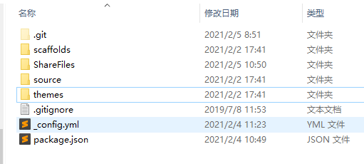

# hexo博客迁移记录


1、新建hexo分支

git checkout -b hexo

并将推送分支并merge到远程分支

git push origin hexo:hexo


2、删除hexo下面除了.git所有内容


3、将现有hexo目录拷贝到hexo分支下




修改.gitgnore里的内容

```
.DS_Store
Thumbs.db
db.json
*.log
node_modules/
public/
.deploy*/
```

