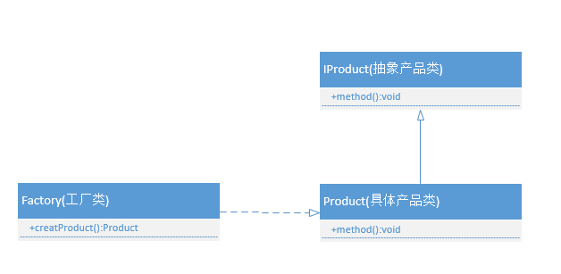
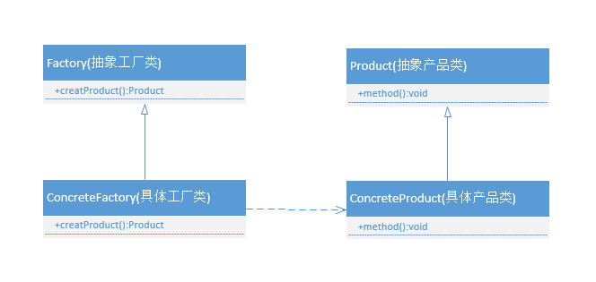

# 工厂模式

介绍简单工厂模式和工厂方法模式。

## 1、简单工厂模式（静态工厂方法模式）

**定义**：简单工厂模式属于创建型模式，又被称为静态工厂方法模式，这是一个工厂对象决定创建出哪一种产品类的实例。



（1）抽象产品类

```java
// 抽象产品类
public abstract class Computer {
	// 产品的抽象方法,由具体的产品类实现
	public abstract void start();
}
```


（2）具体产品类

继承抽象类，具体实现三种产品类。

```java
// 具体产品类,联想计算机
public class LenovoComputer extends Computer {
	
	@Override
	public void start() {
		System.out.println("联想计算机启动");
	}
}

//具体产品类,惠普计算机
public class HpComputer extends Computer {
	
	@Override
	public void start() {
		System.out.println("惠普计算机启动");
	}
}

//具体产品类,华硕计算机
public class AsusComputer extends Computer {
	
	@Override
	public void start() {
		System.out.println("华硕计算机启动");
	}
}
```


（3）工厂类

通过传入具体产品类别来实例化对应对象。

```java
// 工厂类
public class ComputerFactory {
	public static Computer createComputer(String type) {
		Computer mComputer = null;
		switch (type) {
			case "lenovo":
				mComputer = new LenovoComputer();
				break;
			case "hp":
				mComputer = new HpComputer();
				break;
			case "asus":
				mComputer = new AsusComputer();
				break;
		}
		
		return mComputer;
	}
}
```


（4）客户端调用工厂类

```java
// 客户端调用工厂类
public class CreatComputer {
	public static void main(String[] args) {
		ComputerFactory.createComputer("hp").start();
	}
}
```


**简单工厂模式优缺点**

优点：根据参数获取对应的类实例，避免类的直接实例化。

缺点：可实例化对象在编译期间就确定。如果需要新增加类型，则需要重新修改工厂类方法。简单工厂需要知道所有要生成的类型，当子类过多或者层次过多时候不宜使用。


## 2、工厂方法模式

**定义**：定义一个用于创建对象的接口，让子类决定实例化哪个类。工厂方法使一个类的实例化延迟到子类。



（1）抽象产品类（同上、重复内容）

```java
// 抽象产品类
public abstract class Computer {
	// 产品的抽象方法,由具体的产品类实现
	public abstract void start();
}
```


（2）具体产品类（同上、重复内容）

继承抽象类，具体实现三种产品类。

```java
// 具体产品类,联想计算机
public class LenovoComputer extends Computer {
	
	@Override
	public void start() {
		System.out.println("联想计算机启动");
	}
}

//具体产品类,惠普计算机
public class HpComputer extends Computer {
	
	@Override
	public void start() {
		System.out.println("惠普计算机启动");
	}
}

//具体产品类,华硕计算机
public class AsusComputer extends Computer {
	
	@Override
	public void start() {
		System.out.println("华硕计算机启动");
	}
}
```


（3）抽象工厂类

```java
public abstract class ComputerFactory {
	public abstract <T extends Computer> T createComputer(Class<T> clz);
}
```


（4）具体工厂

具体工厂继承抽象工厂，通过反射来生产不同厂家的计算机。

```java
class MyComputerFactor extends Computer {
	@Override
	public <T extends Computer> T creatComputer(Class<T> clz) {
		Computer computer = null;
		String className = clz.getName();
		try {
			// 通过反射来实例化不同厂家的计算机
			computer = (Computer) Class.forName(className).newInstance();
		} catch (Exception e) {
			e.printStackTrace();
		}
		return (T)computer;
	}
}
```


（5）客户端调用

通过反射和抽象工厂来实例化不同厂家计算机

```java
class Client {
	public static void main(String[] args) {
		// 抽象工厂实例化
		ComputerFactory computerFactory = new MyComputerFactor();
		
		// 通过反射和抽象工厂来实例化不同厂家计算机
		LenovoComputer mLenovoComputer = computerFactory.createComputer(LenovoComputer.class);
		mLenovoComputer.start();
		
		HpComputer mHpComputer = computerFactory.createComputer(HpComputer.class);
		mHpComputer.start();
		
		AsusComputer mAsusComputer = computerFactory.createComputer(AsusComputer.class);
		mAsusComputer.start();
		
	}
}
```


**工厂方法模式优缺点**

解决需求更改后不用修改工厂类，而是直接创建具体产品类，通过抽象工厂模式来实例化具体产品对象，解决了与具体产品的依赖，符合开放封闭原则。


