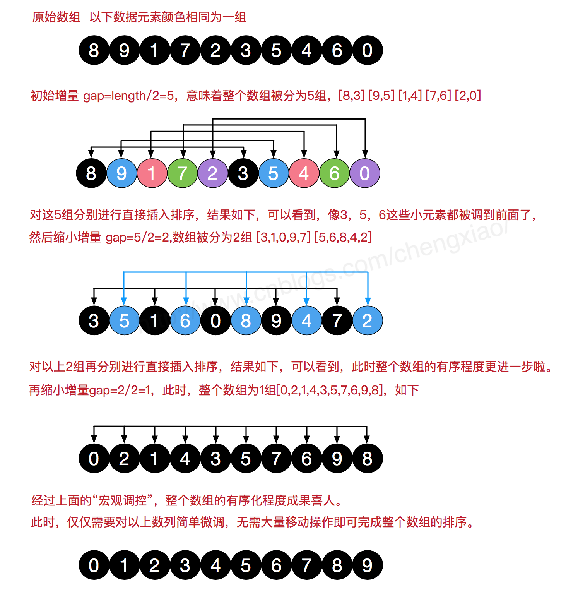

# Java八大排序算法

<!--more-->

## 概要

八大排序算法：直接插入排序（Insertion Sort）、希尔排序（Shell Sort）、选择排序（Selection Sort）、堆排序（Heap Sort）、冒泡排序（Bubble Sort）、快速排序（Quick Sort）、归并排序（Merging Sort）、基数排序（Radix Sort），基数排序也称桶排序。

都属于内部排序算法，其中直接插入排序和希尔排序属于**插入排序**，简单选择排序和堆排序属于**选择排序**，冒泡排序和快速排序属于**交换排序**。

## 直接插入排序算法

通过构建有序序列，对于未排序数据，在已排序序列中从后向前扫描，找到相应的位置并插入。插入排序非常类似于整扑克牌。在开始摸牌时，左手是空的，牌面朝下放在桌上。接着，一次从桌上摸起一张牌，并将它插入到左手一把牌中的正确位置上。为了找到这张牌的正确位置，要将它与手中已有的牌从右到左地进行比较。无论什么时候，左手中的牌都是排好序的。
如果输入数组已经是排好序的话，插入排序出现最佳情况，其运行时间是输入规模的一个线性函数。如果输入数组是逆序排列的，将出现最坏情况。平均情况与最坏情况一样，其时间代价是(n2)。

插入排序的基本操作就是将一个数据插入到已经排好序的有序数据中，从而得到一个新的、个数加一的有序数据，算法适用于少量数据的排序，时间复杂度为O(n^2)。是稳定的排序方法。

通常人们整理桥牌的方法是一张一张的来，将每一张牌插入到其他已经有序的牌中的适当位置。在计算机的实现中，为了要给插入的元素腾出空间，我们需要将其余所有元素在插入之前都向右移动一位。

### 算法描述

一般来说，插入排序都采用in-place在数组上实现。具体算法描述如下：

1、从第一个元素开始，该元素可以认为已经被排序。

2、取出下一个元素，在已经排序的元素序列中从后向前扫描。

3、如果该元素（已排序）大于新元素，将该元素移到下一位置。

4、重复步骤3，直到找到已排序的元素小于或者等于新元素的位置。

5、将新元素插入到该位置后。

6、重复步骤2~5。

```java
// 通过将较大的元素都向右移动而不总是交换两个元素
public static void sort(int[] data) {
	// 装载临时变量
	int temp;
	for (int i = 1; i < data.length; i++) {
		temp = data[i];
		int j = i - 1;
		// 如果前一位比当前数据要大，那么进入循环比较
		for (; j >= 0 && data[j] > temp; j--) {
			// 往后退一个位置，让当前数据与之前前位进行比较
			data[j + 1] = data[j];
		}
		// 退出内层循环，则说明找到了合适的位置，并将当前数据插入合适的位置中
		data[j + 1] = temp;
	}
} // sort end

// 通过交换进行插入排序，借鉴冒泡排序
public static void sortTwo(int[] data) {
	// 装载临时变量
	int temp;
	for (int i = 1; i < data.length; i++) {
		// 如果前一位比当前数据要大，那么进入循环比较，并两两交换，参考冒泡排序
		for (int j = i - 1; j >= 0 && data[j] > data[j + 1]; j--) {
			temp = data[j + 1];
			data[j + 1] = data[j];
			data[j] = temp;
		}
	}
} // sortTwo end
```

### 复杂度分析

| 平均时间复杂度 | 最好情况 | 最坏情况 | 空间复杂度 |
| -------------- | -------- | -------- | ---------- |
| O(n²)          | O(n²)    | O(n²)    | O(1)       |

插入排序所需的时间取决于输入元素的初始顺序。例如，对一个很大且其中的元素已经有序(或接近有序)的数组进行排序将会比随机顺序的数组或是逆序数组进行排序要快得多。

## 希尔排序

希尔排序(Shell's Sort)是插入排序的一种又称“缩小增量排序”（Diminishing Increment Sort），是直接插入排序算法的一种更高效的改进版本。希尔排序是非稳定排序算法。该方法因D.L.Shell 于1959 年提出而得名。

先将整个待排序的记录序列分割成为若干子序列分别进行直接插入排序，待整个序列中的记录“基本有序”时，再对全体记录进行依次直接插入排序。

将待排序数组按照步长gap进行分组，然后将每组的元素利用直接插入排序的方法进行排序；每次再将gap折半减小，循环上述操作；当gap=1时，利用直接插入，完成排序。
可以看到步长的选择是希尔排序的重要部分。只要最终步长为1任何步长序列都可以工作。一般来说最简单的步长取值是初次取数组长度的一半为增量，之后每次再减半，直到增量为1。

### 算法描述

1、选择一个增量序列 t1，t2，……，tk，其中 ti > tj, tk = 1。

2、按增量序列个数 k，对序列进行 k 趟排序。

3、每趟排序，根据对应的增量 ti，将待排序列分割成若干长度为 m 的子序列，分别对各子表进行直接插入排序。仅增量因子为 1 时，整个序列作为一个表来处理，表长度即为整个序列的长度。

引用自网上一张图（侵删）：




```java
public static void sort(int[] data) {
	int temp;
	// 增量每次都/2
	for (int step = data.length / 2; step > 0; step /= 2) {
		// 从增量那组开始进行插入排序，直至完毕
		for (int i = step; i < data.length; i++) {
			temp = data[i];
			int j = i - step;
			for (; j >= 0 && data[j] > temp; j -= step) {
				// 往后退一个step位置，让当前数据与之前前位进行比较
				data[j + step] = data[j];
			}
			// 退出内层循环，则说明找到了合适的位置，并将当前数据插入合适的位置中
			data[j + step] = temp;
		}
	}
} // sort end
```

### 复杂度分析

| 平均时间复杂度 | 最好情况  | 最坏情况  | 空间复杂度 |
| -------------- | --------- | --------- | ---------- |
| O(nlog2n)      | O(nlog2n) | O(nlog2n) | O(1)       |

希尔排序更高效的原因是它权衡了子数组的规模和有序性。排序之初，各个子数组都很短，排序之后子数组都是部分有序的，这两种情况都很适合插入排序。

## 选择排序

选择排序(Selection sort)是一种简单直观的排序算法。它的工作原理是每一次从待排序的数据元素中选出最小(或最大)的一个元素，存放在序列的起始(末尾)位置，直到全部待排序的数据元素排完。选择排序是不稳定的排序方法（比如序列[5， 5， 3]第一次就将第一个[5]与[3]交换，导致第一个5 挪动到第二个5 后面）。

选择排序的主要优点与数据移动有关。如果某个元素位于正确的最终位置上，则它不会被移动。选择排序每次交换一对元素，它们当中至少有一个将被移到其最终位置上，因此对 n个元素的表进行排序总共进行至多 n-1 次交换。在所有的完全依靠交换去移动元素的排序方法中，选择排序属于非常好的一种。

### 算法描述：

1、从未排序序列中，找到关键字最小的元素。

2、如果最小元素不是未排序序列的第一个元素，将其和未排序序列第一个元素互换。

3、重复1、2步，直到排序结束。

```java
public static void sort(int[] data) {
	// 记录当前趟数的最小值的角标
	int minPos;
	// 交换的变量
	int temp;
	for (int i = 0; i < data.length; i++) {
		// 新的趟数的起点
		minPos = i;
		// 选出之后排序中值最小的位置
		for (int j = i + 1; j < data.length; j++) {
			if (data[j] < data[i]) {
				minPos = j;
			}
		}
		// 最小值不等于当前值时进行交换
		if (minPos != i) {
			temp = data[i];
			data[i] = data[minPos];
			data[minPos] = temp;
		}
	}
} // sort end
```

### 复杂度分析

| 平均时间复杂度 | 最好情况 | 最坏情况 | 空间复杂度 |
| -------------- | -------- | -------- | ---------- |
| O(n²)          | O(n²)    | O(n²)    | O(1)       |

选择排序的简单和直观名副其实，这也造就了它”出了名的慢性子”，无论是哪种情况，哪怕原数组已排序完成，它也将花费将近n²/2次遍历来确认一遍。即便是这样，它的排序结果也还是不稳定的。 唯一值得高兴的是，它并不耗费额外的内存空间。

## 堆排序

### 复杂度分析

| 平均时间复杂度 | 最好情况 | 最坏情况 | 空间复杂度 |
| -------------- | -------- | -------- | ---------- |
| O(n²)          | O(n²)    | O(n²)    | O(1)       |


## 冒泡排序

冒泡排序（Bubble Sort，台湾译为：泡沫排序或气泡排序）是一种简单的排序算法。它重复地走访过要排序的数列，一次比较两个元素，如果他们的顺序错误就把他们交换过来。走访数列的工作是重复地进行直到没有再需要交换，也就是说该数列已经排序完成。这个算法的名字由来是因为越大的元素会经由交换慢慢“浮”到数列的顶端，故名。

### 算法描述：

描述一：

1、i从0开始，i与i+1比较，如果后面的数（i+1）小于前面的数（i），则交换。
2、i不断增加，直到i<n-1（数组长度减一），一趟下来，可以让数组元素中的最大值排在数组的最后，直到完成。

描述二：

1、比较相邻的元素。如果第一个比第二个大，就交换他们两个。

2、对每一对相邻元素作同样的工作，从开始第一对到结尾的最后一对。这步做完后，最后的元素会是最大的数。

3、针对所有的元素重复以上的步骤，除了最后一个。

4、持续每次对越来越少的元素重复上面的步骤，直到没有任何一对数字需要比较。

```java
public static void sort(int[] data) {
	// 测试用，记录执行了多少趟
	int num = 0;
	// 装载临时变量
	int temp;
	// 外层是排序的趟数
	for (int i = 0; i < data.length - 1; i++) {
		// 内层循环是当前趟数需要比较的次数
		for (int j = 0; j < data.length - i - 1; j++) {
			// 前一位与后一位相比较，如果前一位比后一位要大，则交换
			if (data[j + 1] < data[j]) {
				temp = data[j + 1];
				data[j + 1] = data[j];
				data[j] = temp;
			}
		}
		num++;
	}
	System.out.println("Sort run frequency is : " + num);
} // sort end
```

### 复杂度分析

| 平均时间复杂度 | 最好情况 | 最坏情况 | 空间复杂度 |
| -------------- | -------- | -------- | ---------- |
| O(n²)          | O(n)     | O(n²)    | O(1)       |

冒泡排序是最容易实现的排序, 最坏的情况是每次都需要交换, 共需遍历并交换将近n²/2次, 时间复杂度为O(n²). 最佳的情况是内循环遍历一次后发现排序是对的, 因此退出循环, 时间复杂度为O(n). 平均来讲, 时间复杂度为O(n²). 由于冒泡排序中只有缓存的temp变量需要内存空间, 因此空间复杂度为常量O(1).

### 冒泡排序优化

如果数据足够乱的情况下，例如反序，需要数据长度-1趟才能将数据完整排好序。

但是在部分有序情况下，例如在第3趟比较后就已经得到了排好序的数组，就没有必要执行后面的计算了。我们可以做如下优化：

- 如果在某趟排序中没有发生交换位置，那么我们可以认为该数组已经排好顺序了。（我们每趟排序的目的就是为了将当前趟最大的数置换到对应的位置上，如果没有发生置换说明已经是排好序的了）。

```java
public static void betterSort(int[] data) {
	// 测试用，记录执行了多少趟
	int num = 0;
	// 装载临时变量
	int temp;
	// 记录是否发生了置换，0代表没有发生置换，1代表发生了置换
	int isChange;
	// 外层是排序的趟数
	for (int i = 0; i < data.length - 1; i++) {
		// 每比较一趟就重新初始化为0
		isChange = 0;
		// 内层循环是当前趟数需要比较的次数
		for (int j = 0; j < data.length - i - 1; j++) {
			// 前一位与后一位相比较，如果前一位比后一位要大，则交换
			if (data[j + 1] < data[j]) {
				temp = data[j + 1];
				data[j + 1] = data[j];
				data[j] = temp;

				// 如果进到这里面了，说明发生了置换
				isChange = 1;
			}
		}
		// 如果比较完一趟没有发生置换，那么说明已经排好序了，不需要再执行下去了
		if (isChange == 0) {
			break;
		}
		num++;
	}
	System.out.println("betterSort run frequency is : " + num);
} // better sort end
```

## 快速排序

快速排序由C. A. R. Hoare 在1962 年提出。它的基本思想是：通过一趟排序将要排序的数据分割成独立的两部分，其中一部分的所有数据都比另外一部分的所有数据都要小，然后再按此方法对这两部分数据分别进行快速排序，整个排序过程可以递归进行，以此达到整个数据变成有序序列。

一次循环：从后往前比较，用基准值和最后一个值比较，如果比基准值小的交换位置，如果没有继续比较下一个，直到找到第一个比基准值小的值才交换。找到这个值之后，又从前往后开始比较，如果有比基准值大的，交换位置，如果没有继续比较下一个，直到找到第一个比基准值大的值才交换。直到从前往后的比较索引>从后往前比较的索引，结束第一次循环，此时，对于基准值来说，左右两边就是有序的了。

### 算法思想：

快速排序的基本思想：**挖坑填数+分治法**。

快速排序使用分治法（Divide and conquer）策略来把一个串行（list）分为两个子串行（sub-lists）。

快速排序又是一种分而治之思想在排序算法上的典型应用。本质上来看，快速排序应该算是在冒泡排序基础上的递归分治法。

快速排序的名字起的是简单粗暴，因为一听到这个名字你就知道它存在的意义，就是快，而且效率高！它是处理大数据最快的排序算法之一了。虽然 Worst Case 的时间复杂度达到了 O(n²)，但是人家就是优秀，在大多数情况下都比平均时间复杂度为 O(n logn) 的排序算法表现要更好。

快速排序使用分治策略来把一个序列（list）分为两个子序列（sub-lists），算法步骤：

1、从数列中挑出一个元素，称为"基准"（pivot）。

2、重新排序数列，所有比基准值小的元素摆放在基准前面，所有比基准值大的元素摆在基准后面（相同的数可以到任一边）。在这个分区结束之后，该基准就处于数列的中间位置。这个称为分区（partition）操作。

3、递归地（recursively）把小于基准值元素的子数列和大于基准值元素的子数列排序。

递归到最底部时，数列的大小是零或一，也就是已经排序好了。

```java
public static void sort(int[] data, int L, int R) {
	System.out.println("sort start, L : " + L + " ,R : " + R);
	int i = L;
	int j = R;

	// 交换的变量
	int temp;
	// 支点
	int pivot = data[L + (R - L) / 2];

	// 左右两端进行扫描，只要两端没有交替，就一直扫描
	while (i <= j) {
		// 左边寻找直到比支点大的数
		while (pivot > data[i]) {
			i++;
		}

		// 右边寻找直到比支点小的数
		while (pivot < data[j]) {
			j--;
		}

		// 此时已经分别找到了比支点小的数（右边）、比支点大的数（左边），它们进行交换
		if (i <= j) {
			temp = data[i];
			data[i] = data[j];
			data[j] = temp;
			// 左边右移一位
			i++;
			// 右边左移一位
			j--;
		}
	}
	// 上面一个while保证了第一趟排序支点的左边比支点小，支点的右边比支点大了。

	// 左边再做排序，直到左边剩下一个数（递归出口）
	if (L < j) {
		System.out.println("sort left before, L : " + L + " ,j : " + j);
		sort(data, L, j);
		System.out.println("sort left end, L : " + L + " ,j : " + j);
	}
	// 右边再做排序，直到右边剩下一个数（递归出口）
	if (i < R) {
		System.out.println("sort right before, i : " + i + " ,R : " + R);
		sort(data, i, R);
		System.out.println("sort right end, i : " + i + " ,R : " + R);
	}
} // sort end
```

### 复杂度分析

| 平均时间复杂度 | 最好情况  | 最坏情况 | 空间复杂度 |
| -------------- | --------- | -------- | ---------- |
| O(nlog₂n)      | O(nlog₂n) | O(n²)    | O(1)       |

## 归并排序

归并排序（MERGE-SORT）是建立在归并操作上的一种有效的排序算法,该算法是采用**分治法（Divide and Conquer）**的一个非常典型的应用。将已有序的子序列合并，得到完全有序的序列；即先使每个子序列有序，再使子序列段间有序。若将两个有序表合并成一个有序表，称为二路归并。

归并排序可通过两种方式实现:

- 自上而下的递归
- 自下而上的迭代

递归法（假设序列共有n个元素）：

1、将序列每相邻两个数字进行归并操作，形成 floor(n/2)个序列，排序后每个序列包含两个元素；

2、将上述序列再次归并，形成 floor(n/4)个序列，每个序列包含四个元素；

3、重复步骤2，直到所有元素排序完毕。

### 算法思想

迭代法归并操作的工作原理如下：

1、申请空间，使其大小为两个已经排序序列之和，该空间用来存放合并后的序列。

2、设定两个指针，最初位置分别为两个已经排序序列的起始位置。

3、比较两个指针所指向的元素，选择相对小的元素放入到合并空间，并移动指针到下一位置。

4、重复步骤3 直到某一指针超出序列尾。

5、将另一序列剩下的所有元素直接复制到合并序列尾。

归并排序其实要做两件事：

- 分解：将序列每次折半拆分
- 合并：将划分后的序列段两两排序合并

```java
public static void sort(int[] data, int L, int R) {
	// 如果只有一个元素，那就不用排序了
	if (L == R) {
		return;
	} else {
		// 取中间的数，进行拆分
		int M = L + (R - L) / 2;

		System.out.println("sort left before, L : " + L + " ,M : " + M);
		// 左边的数不断进行拆分
		sort(data, L, M);
		System.out.println("sort left end, L : " + L + " ,M : " + M);

		System.out.println("sort right before, M+1 : " + (M + 1) + " ,R : " + R);
		// 右边的数不断进行拆分
		sort(data, M + 1, R);
		System.out.println("sort right end, M+1 : " + (M + 1) + " ,R : " + R);

		System.out.println("merge before, L: " + L + ", M+1 : " + (M + 1) + " ,R : " + R);
		// 合并
		merge(data, L, M + 1, R);
		System.out.println("merge end, L: " + L + ", M+1 : " + (M + 1) + " ,R : " + R);
	}
} // sort end

public static void merge(int[] data, int L, int M, int R) {
	// 左边数组的大小
	int[] leftData = new int[M - L];

	// 右边数组的大小
	int[] rightData = new int[R - M + 1];

	// 往这两个数组填充数据
	for (int i = L; i < M; i++) {
		leftData[i - L] = data[i];
	}

	for (int i = M; i <= R; i++) {
		rightData[i - M] = data[i];
	}

	int i = 0, j = 0;
	// data数组的第一个元素
	int k = L;

	// 比较两个数组的值，哪个小，就往数组上放
	while (i < leftData.length && j < rightData.length) {
		// 谁比较小，谁将元素放入大数组中，移动指针，继续比较下一个
		if (leftData[i] < rightData[j]) {
			data[k] = leftData[i];

			i++;
			k++;
		} else {
			data[k] = rightData[j];

			j++;
			k++;
		}
	}

	// 如果左边数组没有比较完，右边数组已经完了，那么将左边数组复制到大数组中（剩下的都是大数字）
	while (i < leftData.length) {
		data[k] = leftData[i];

		i++;
		k++;
	}

	// 如果右边数组没有比较完，左边数组已经完了，那么将右边数组复制到大数组中（剩下的都是大数字）
	while (j < rightData.length) {
		data[k] = rightData[j];

		j++;
		k++;
	}

} // merge end
```


### 复杂度分析

| 平均时间复杂度 | 最好情况  | 最坏情况  | 空间复杂度 |
| -------------- | --------- | --------- | ---------- |
| O(nlog₂n)      | O(nlog₂n) | O(nlog₂n) | O(1)       |

从效率上看，归并排序可算是排序算法中的”佼佼者”. 假设数组长度为n，那么拆分数组共需logn，, 又每步都是一个普通的合并子数组的过程， 时间复杂度为O(n)， 故其综合时间复杂度为O(nlogn)。另一方面， 归并排序多次递归过程中拆分的子数组需要保存在内存空间， 其空间复杂度为O(n)。

归并排序最吸引人的性质是它能够保证将任意长度为N的数组排序所需时间和NlogN成正比，它的主要缺点则是他所需的额外空间和N成正比。

## 基数排序（桶排序）

基数排序(radix sort)属于"分配式排序"(distribution sort)，又称"桶子法"(bucket sort)或bin sort，顾名思义，它是透过键值的部份资讯，将要排序的元素分配至某些"桶"中，藉以达到排序的作用，基数排序法是属于稳定性的排序，其时间复杂度为O (nlog(r)m)，其中r 为所采取的基数，而m 为堆数，在某些时候，基数排序法的效率高于其它的稳定性排序法。基数排序不同与其他的7种排序，其他7 种排序本质上都是按照交换或者比较来进行排序，但是基数排序并不是，它是按照分配，回收(分配到不同的位置上，然后回收)..不断分配..回收来进行排序，直到有序。

基数排序（Radix sort）是一种非比较型整数排序算法，其原理是将整数按位数切割成不同的数字，然后按每个位数分别比较。由于整数也可以表达字符串（比如名字或日期）和特定格式的浮点数，所以基数排序也不是只能使用于整数。

### 算法思想

基数排序：通过序列中各个元素的值，对排序的N个元素进行若干趟的“分配”与“收集”来实现排序。

**分配**：我们将L[i]中的元素取出，首先确定其个位上的数字，根据该数字分配到与之序号相同的桶中

**收集**：当序列中所有的元素都分配到对应的桶中，再按照顺序依次将桶中的元素收集形成新的一个待排序列L[]。对新形成的序列L[]重复执行分配和收集元素中的十位、百位...直到分配完该序列中的最高位，则排序结束

它是这样实现的：将所有待比较数值（正整数）统一为同样的数位长度，数位较短的数前面补零。然后，从最低位开始，依次进行一次排序。这样从最低位排序一直到最高位排序完成以后，数列就变成一个有序序列。

基数排序按照优先从高位或低位来排序有两种实现方案：

- MSD（Most significant digital） 从最左侧高位开始进行排序。先按k1排序分组, 同一组中记录, 关键码k1相等, 再对各组按k2排序分成子组, 之后, 对后面的关键码继续这样的排序分组, 直到按最次位关键码kd对各子组排序后. 再将各组连接起来, 便得到一个有序序列。MSD方式适用于位数多的序列。

- LSD （Least significant digital）从最右侧低位开始进行排序。先从kd开始排序，再对kd-1进行排序，依次重复，直到对k1排序后便得到一个有序序列。LSD方式适用于位数少的序列。

以LSD为例，从最低位开始，算法步骤：

1、取得数组中的最大数，并取得位数；

2、arr为原始数组，从最低位开始取每个位组成radix数组；

3、对radix进行计数排序（利用计数排序适用于小范围数的特点）；

```java
public static void sort(int[] data) {
	if (data.length <= 1) {
		return;
	}

	// 取得数组中最大的数，并取得位数
	int max = 0;
	for (int i = 0; i < data.length; i++) {
		if (max < data[i]) {
			max = data[i];
		}
	}
	// 位数计算
	int maxDigit = 1;
	while (max / 10 > 0) {
		maxDigit++;
		max = max / 10;
	}

	// 申请一个桶空间，二维数组
	int[][] buckets = new int[10][data.length];
	int base = 10;

	// 从低位到高位，对每一位遍历，将所有元素分配到桶中
	for (int i = 0; i < maxDigit; i++) {
		// 存储各个桶中存储元素的数量
		int[] bktLen = new int[10];

		// 分配，将所有元素分配到桶中
		for (int j = 0; j < data.length; j++) {
			int whichBucket = (data[j] % base) / (base / 10);
			buckets[whichBucket][bktLen[whichBucket]] = data[j];
			bktLen[whichBucket]++;
		}

		// 收集，将不同桶里的数据挨个捞出来，为下一轮高位排序做准备，由于靠近桶底的元素排名靠前，因此从桶底先捞
		int k = 0;
		for (int b = 0; b < buckets.length; b++) {
			for (int p = 0; p < bktLen[b]; p++) {
				data[k++] = buckets[b][p];
			}
		}
		base *= 10;
	}
} // sort end
```

### 复杂度分析

| 平均时间复杂度 | 最好情况     | 最坏情况     | 空间复杂度 |
| -------------- | ------------ | ------------ | ---------- |
| O(d*(n + r))   | O(d*(n + r)) | O(d*(n + r)) | O(n+r)     |

其中，d 为位数，r 为基数，n 为原数组个数。在基数排序中，因为没有比较操作，所以在复杂上，最好的情况与最坏的情况在时间上是一致的，均为 O(d*(n + r))。

备注：

基数排序更适合用于对时间, 字符串等这些 整体权值未知的数据 进行排序。

基数排序不改变相同元素之间的相对顺序，因此它是稳定的排序算法。

基数排序 vs 计数排序 vs 桶排序

这三种排序算法都利用了桶的概念，但对桶的使用方法上有明显差异：

1、基数排序：根据键值的每位数字来分配桶

2、计数排序：每个桶只存储单一键值

3、桶排序：每个桶存储一定范围的数值


## 八大排序算法总结

从时间复杂度来说：

1、平方阶O(n²)排序：**各类简单排序：直接插入、直接选择和冒泡排序**

2、线性对数阶O(nlog₂n)排序：**快速排序、堆排序和归并排序**

3、O(n1+§))排序，§是介于0和1之间的常数：**希尔排序**

4、线性阶O(n)排序：**基数排序，此外还有桶、箱排序**