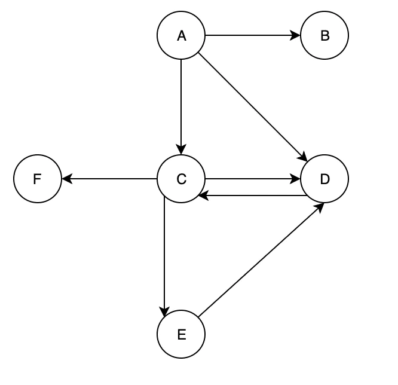
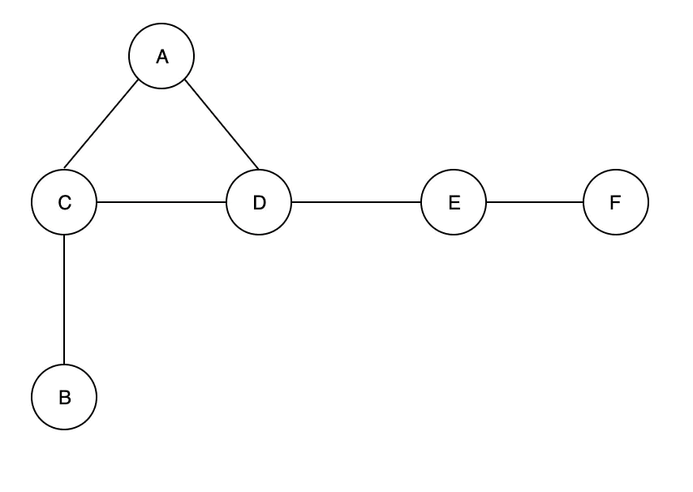
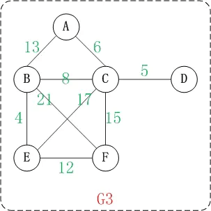

# Java数据结构与算法概览

<!--more-->

## 数据结构

### 定义

1、数据结构是指相互之间存在一种或多种特定关系的数据元素的集合。它是储存数据的一种结构体，在此结构中储存一些数据，而这些数据之间有一定的关系。

2、数据元素之间的相互关系包括：数据的逻辑结构、数据的存储结构、数据的运算结构。

3、数据结构的设计过程分为：抽象层、数据结构层、实现层。

### 逻辑结构分类

线性数据结构：数组，线性表，栈，队列，串等。

非线性数据结构：多维数组，集合，树，图，散列表(hash)。

#### 树

定义：树形结构，作者觉得它是一种特殊的链形数据结构。最少有一个根节点组成，可以有多个子节点。树，显然是由递归算法组成。

种类：

（1）二叉树：每个节点最多含有两个子节点的树称为二叉树。

- 1）一般二叉树：无限制，每个子节点的父亲节点不一定有两个子节点的二叉树成为一般二叉树。
- 2）完全二叉树：对于一颗二叉树，假设其深度为d（d>1）。除了第d层外，其它各层的节点数目均已达最大值，且第d层所有节点从左向右连续地紧密排列，这样的二叉树被称为完全二叉树；
- 3）满二叉树：所有的节点都是二叉的二叉树成为满二叉树。

（2）二叉搜索树/BST：二叉排序树、二叉查找树。是有序的。要点：如果不为空，那么其左子树节点的值都小于根节点的值；右子树节点的值都大于根节点的值。

- 1）二叉平衡树：二叉搜索树，是有序的排序树，但左右两边包括子节点不一定平衡，而二叉平衡树是排序树的一种，并且加点条件，就是任意一个节点的两个叉的深度差不多（比如差值的绝对值小于某个常数，或者一个不能比另一个深出去一倍之类的）。这样的树可以保证二分搜索任意元素都是O(log n)的，一般还附带带有插入或者删除某个元素也是O(log n)的的性质。
- 2）AVL树：最早的平衡二叉树之一。windows对进程地址空间的管理用到了AVL树。
- 3）红黑树：通过制定了一些红黑标记和左右旋转规则来保证二叉树平衡。

（3）B树/B-tree：又叫平衡(balance)多路查找树。树中每个结点最多含有m个孩子（m>=2）。它类似普通的平衡二叉树，不同的一点是B-树允许每个节点有更多的子节点。

#### 图

##### 定义

图是由结点的有穷集合V和边的集合E组成。其中，为了与树形结构加以区别，在图结构中常常将结点称为顶点，边是顶点的有序偶对，若两个顶点之间存在一条边，就表示这两个顶点具有相邻关系，通常记为，G=(V,E)。

##### 分类：

分为无向图和有向图。

无向图G1：

上面的图是有向图。和无向图不同，有向图的所有的边都是有方向的！ G2=(V1,{E1})。其中，

（1）V1={A,C,B,F,D,E}。 V2表示由"A,B,C,D,E,F"几个顶点组成的集合。

（2）E1={<A,B>,<A,C>,<A,D>,<C,D>,<C,E>,<C,F>,<D,C>,<E,D>}。 E1是由矢量<A,B>,矢量<A,C>...等等组成的集合。其中，矢量<A,B)表示由"顶点A"指向"顶点B"的有向边。

无向图G2：

上面的图是无向图，无向图的所有的边都是不区分方向的。G0=(V1,{E1})。其中，

（1）V1={A,B,C,D,E,F}。 V1表示由"A,B,C,D,E,F"几个顶点组成的集合。

（2）E1={(A,C),(A,D),(B,C),(D,E),(E,F)}。 E1是由边(A,C),边(A,D)...等等组成的集合。其中，(A,C)表示由顶点A和顶点C连接成的边。

##### 邻接点

一条边上的两个顶点叫做邻接点。
例如，上面无向图中的顶点A和顶点C就是邻接点。
在有向图中，除了邻接点之外；还有"入边"和"出边"的概念。
顶点的入边，是指以该顶点为终点的边。而顶点的出边，则是指以该顶点为起点的边。
例如，上面有向图中的A和C是邻接点；<A,C>是A的出边，还是C的入边。

##### 度

在无向图中，某个顶点的度是邻接到该顶点的边(或弧)的数目。
例如，上面无向图G2中顶点A的度是2。
在有向图中，度还有"入度"和"出度"之分。
某个顶点的入度，是指以该顶点为终点的边的数目。而顶点的出度，则是指以该顶点为起点的边的数目。
顶点的度=入度+出度。
例如，上面有向图G1中，顶点C的入度是2，出度是3；顶点B的度=2+3=5。

##### 路径和回路

路径：如果顶点(Vm)到顶点(Vn)之间存在一个顶点序列。则表示Vm到Vn是一条路径。
路径长度：路径中"边的数量"。
简单路径：若一条路径上顶点不重复出现，则是简单路径。
回路：若路径的第一个顶点和最后一个顶点相同，则是回路。
简单回路：第一个顶点和最后一个顶点相同，其它各顶点都不重复的回路则是简单回路。

##### 连通图和连通分量

连通图：对无向图而言，任意两个顶点之间都存在一条无向路径，则称该无向图为连通图。 对有向图而言，若图中任意两个顶点之间都存在一条有向路径，则称该有向图为强连通图。
连通分量：非连通图中的各个连通子图称为该图的连通分量。

##### 权

带权图如下：

##### 存储结构

图的存储结构，常用的是**邻接矩阵**和**邻接表**

##### 图的遍历

深度优先搜索（DFS）：递归实现；或者定义栈，使用非递归方法。

广度优先搜索（BFS）：队列实现，自动查找从一个顶点到另一个相邻顶点的最短路径。

##### 图的算法

（1）最短路径问题：Dijkstra算法，算法的思路如下，Dijkstra算法采用的是一种贪心的策略，声明一个数组dis来保存源点到各个顶点的最短距离和一个保存已经找到了最短路径的顶点的集合：T，初始时，原点 s 的路径权重被赋为 0 （dis[s] = 0）。若对于顶点 s 存在能直接到达的边（s,m），则把dis[m]设为w（s, m）,同时把所有其他（s不能直接到达的）顶点的路径长度设为无穷大。初始时，集合T只有顶点s。 然后，从dis数组选择最小值，则该值就是源点s到该值对应的顶点的最短路径，并且把该点加入到T中，OK，此时完成一个顶点， 然后，我们需要看看新加入的顶点是否可以到达其他顶点并且看看通过该顶点到达其他点的路径长度是否比源点直接到达短，如果是，那么就替换这些顶点在dis中的值。 然后，又从dis中找出最小值，重复上述动作，直到T中包含了图的所有顶点。

（2）拓扑排序：拓扑排序（Topological Sorting）是一个**有向无环图**（DAG, Directed Acyclic Graph）的所有顶点的线性序列。序列必须满足下面两个条件：一个是每个顶点出现且只出现一次，另一个是若存在一条从顶点A 到顶点 B 的路径，那么在序列中顶点 A 出现在顶点 B 的前面。

计算方法：

- 从DAG 图中选择一个 没有前驱（即入度为0）的顶点并输出。
- 从图中删除该顶点和所有以它为起点的有向边。
- 重复1 和 2 直到当前的 DAG 图为空或当前图中不存在无前驱的顶点为止。后一种情况说明有向图中必然存在环。

（3）最小生成树：

- Kruskal算法：此算法可以称为 “加边法”，初始最小生成树边数为0，每迭代一次就选择一条满足条件的最小代价边，加入到最小生成树的边集合里。
- Prime算法：此算法可以称为 “加点法”，每次迭代选择代价最小的边对应的点，加入到最小生成树中。算法从某一个顶点 s 开始，逐渐长大覆盖整个连通网的所有顶点。

##### 现实应用

（1）交通流量建模：顶点可以表示街道的十字路口，边表示街道。加权的边可以表示限速或者车道的数量。建模人员可以用这个系统来判断最佳路线及最有可能堵车的街道。

（2）运输系统：比如，航空公司可以用图来为其飞行系统建模。将每个机场看成顶点，将经过两个顶点的每条航线看作一条边。加权的边可以看作从一个机场到另一个机场的航班成本，或两个机场之间的距离，这取决与建模的对象是什么。

（3）局域网、广域网等计算机网络

（4）消费市场：顶点可以用来表示供应商和消费者。

#### Hash

定义：

（1）Hash，一般翻译做“散列”，也有直接音译为“哈希”的，就是把任意长度的输入（又叫做预映射， pre-image），变换成固定长度的输出，该输出就是散列值。一般通过Hash算法实现。

（2）所谓的Hash算法都是散列算法，把任意长度的输入，变换成固定长度的输出，该输出就是散列值.（如：MD5,SHA1,加解密算法等）

（3）简单的说就是一种将任意长度的消息压缩到某一固定长度的消息摘要的函数。

##### Hash表

Java中数据存储方式最底层的两种结构，一种是数组，另一种就是链表。而Hash表就是综合了这两种数据结构。

例如：HashTable,HashMap，哈希表具有较快（常量级）的查询速度，及相对较快的增删速度，所以很适合在海量数据的环境中使用。一般实现哈希表的方法采用“拉链法”，我们可以理解为“链表的数组”。

##### 一致性Hash

Hash很好的解决了单体应用情况下的数据查找和插入的速度问题。但是毕竟单体应用的储存空间是有限的，所有在分布式环境下，应运而生了一致性Hash算法。

用意和hashCode的用意一样，只不过它是取模放在不同的IP机器上而已。

一致性Hash需要注意的就是默认分配的桶比较多些，而当其中一台机器挂了，影响的面比较小一些。

需要注意的是，相同的内容算出来的hash一定是一样的。既：幂等性。

## 算法

### 定义：

算法（Algorithm）是指解题方案的准确而完整的描述，是一系列解决问题的清晰指令，算法代表着用系统的方法描述解决问题的策略机制。也就是说，能够对一定规范的输入，在有限时间内获得所要求的输出。

### 评定

时间复杂度：算法的时间复杂度是指执行算法所需要的计算工作量。简单理解，算法在规模为n的情况下，一个算法语句执行的次数。

空间复杂度：算法的空间复杂度是指算法需要消耗的内存空间。简单理解，算法在规模为n的情况下额外消耗的存储空间。

### 常见算法

查找：顺序查找、二分查找、插值查找、

排序（八大排序算法）：直接插入排序（Insertion Sort）、希尔排序（Shell Sort）、选择排序（Selection Sort）、堆排序（Heap Sort）、冒泡排序（Bubble Sort）、快速排序（Quick Sort）、归并排序（Merging Sort）、基数排序（Radix Sort）

其它：分治法、贪心算法、动态规划算法、回溯法、分支限界法

### 加密算法

对称加密算法、非对称加密算法、签名

常见算法：AES、RSA、CRC、MD5

