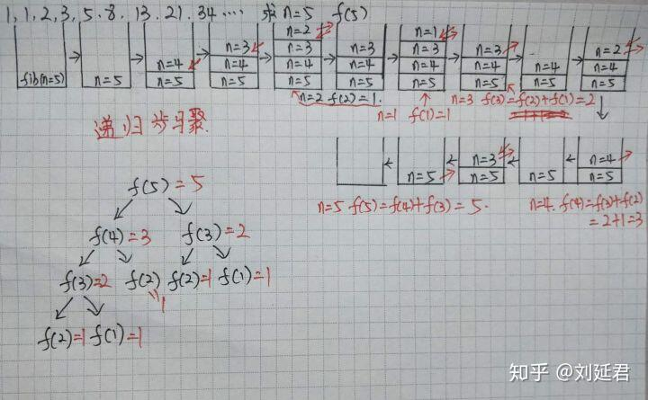

# 递归算法

<!--more-->

## 尾递归的数学理解

示例：阶乘f(n) = n * f(n-1)

以计算f(5)为例

```shell
f(5)
=>5 * f(4)
=>5 * (4 * f(3))
=>5 * (4 * (3 * f(2)))
=>5 * (4 * (3 * (2 * f(1))))
<=5 * (4 * (3 * (2 * 1))) 
<=5 * (4 * (3 * 2)) 
<=5 * (4 * 6) 
<=5 * 24
<=120

#备注：=>是一个递进的过程，<=是回归的过程，这就是尾递归的逻辑
#递归是一个入栈出栈的过程
```

## 递归

递归定义：程序调用自身的编程技巧称为递归（ recursion）。递归做为一种算法在程序设计语言中广泛应用。 一个过程或函数在其定义或说明中有直接或间接调用自身的一种方法，它通常把一个大型复杂的问题层层转化为一个与原问题相似的规模较小的问题来求解，递归策略只需少量的程序就可描述出解题过程所需要的多次重复计算，大大地减少了程序的代码量。递归的能力在于用有限的语句来定义对象的无限集合。一般来说，递归需要有**边界条件**、**递归前进段**和**递归返回段**。当边界条件不满足时，递归前进；当边界条件满足时，递归返回。

通俗来讲，递归是函数调用自身函数的一种现象，函数不断引用自身，直到引用对象已知。

递归三大要素为：**递归前进段**，**边界条件**，**递归返回段**

递归可以总结以下三点：

（1）明确函数的功能，即需要解决什么样的问题。

（2）具备边界调节，否则一直递归下去。

（3）函数的等价关系，则可以理解如何前进，如何返回。

例如阶乘的函数等价关系为f(n) = n * f(n-1)，这种跟数学归纳法有点类似，但是递归是有限处理并得到最终结果，而数学归纳法是归纳一种现象，且可以无限延生。

优缺点：

（1）优点：思路清晰，代码简单；将复杂大问题分解为小问题解决。

（2）缺点：基于栈内存运气，占空间。


备注：明白一个函数的作用并相信它能完成这个任务，千万不要试图跳进细节。千万不要跳进这个函数里面企图探究更多细节，否则就会陷入无穷的细节无法自拔，人脑能压几个栈啊。

### 阶乘

边界条件：当n为1的时候结束返回数值1

函数等价关系：f(n) = n * f(n-1)

```java
public static int factorialRecursion(int n) {
	// 边界条件
	if (n <= 1) {
		return 1;
	}

    // 函数等价关系
	return n * factorialRecursion(n - 1);
}
```


### 斐波那契数

问题描述：斐波那契数列的是这样一个数列：1、1、2、3、5、8、13、21、34....，即第一项 f(1) = 1,第二项 f(2) = 1.....,第 n 项目为 f(n) = f(n-1) + f(n-2)。求第 n 项的值是多少。

边界条件：当n为1或者2的时候结束返回数值1

函数等价关系：f(n) = f(n-1) + f(n-2)

```java
public static int fibonacciRecursion(int n) {
	// 边界条件
	if (n <= 2) {
		return 1;
	}
		
	// 函数等价关系
	return fibonacciRecursion(n - 1) + fibonacciRecursion(n - 2);
}
```

附上知乎的理解（侵删）：




### 其它

#### 循环与递归

循环是有去无回，而递归则是有去有回(因为存在终止条件)。

例如：

（1）你用你手中的钥匙打开一扇门，结果去发现前方还有一扇门，紧接着你又用钥匙打开了这扇门，然后你又看到一扇们...但是当你开到某扇门时，发现前方是一堵墙无路可走了，你选择原路返回——这就是递归。

（2）但是如果你打开一扇门后，同样发现前方也有一扇们，紧接着你又打开下一扇门...直到打开最后一扇门出去，或者一直没有碰到尽头 （死循环）——这就是循环。

#### 分治算法与递归

分治算法的基本思想是将一个规模为N的问题分解为K个规模较小的子问题，这些子问题相互独立且与原问题性质相同。求出子问题的解，就可得到原问题的解。即一种分目标完成程序算法，简单问题可用二分法完成。

分治算法是用迭代的方法将每一次的过程不断重复，每次迭代的结果会作为下次迭代的初始值。分治算法典型案例为二分查找。

- 递归能写的，迭代不一定能写。
- 迭代能写的，递归一定能完成。


#### 回溯算法与递归

回溯算法实际上一个类似枚举的搜索尝试过程，主要是在搜索尝试过程中寻找问题的解，当发现已不满足求解条件时，就“回溯”返回，尝试别的路径。

回溯法是一种选优搜索法，按选优条件向前搜索，以达到目标。但当探索到某一步时，发现原先选择并不优或达不到目标，就退回一步重新选择，这种走不通就退回再走的技术为回溯法。

**回溯的思路**基本如下：当前局面下，我们有若干种选择，所以我们对每一种选择进行尝试。如果发现某种选择违反了某些限定条件，此时 return；如果尝试某种选择到了最后，发现该选择是正确解，那么就将其加入到解集中。
在这种思想下，我们需要清晰的找出三个要素：**选择 (Options)**，**限制 (Restraints)**，**结束条件 (Termination)**。

用回溯算法解决问题的一般步骤为:
1、定义一个解空间，它包含问题的解。
2、利用适于搜索的方法组织解空间。
3、利用深度优先法搜索解空间。
4、利用限界函数避免移动到不可能产生解的子空间。
问题的解空间通常是在搜索问题的解的过程中动态产生的，这是回溯算法的一个重要特性。

例如探索迷宫问题。

回溯算法的基本框架如下：

```python
result = []
def backtrack(路径, 选择列表):
    if 满足结束条件:
        result.add(路径)
        return
    
    for 选择 in 选择列表:
        做选择
        backtrack(路径, 选择列表)
        撤销选择
```


##### 回溯算法与递归的区别

递归是一种算法结构。递归会出现在子程序中，形式上表现为直接或间接的自己调用自己。典型的例子是阶乘，计算规律为：n!=n×(n−1)!
回溯是一种算法思想，它是用递归实现的。回溯的过程类似于穷举法，但回溯有“剪枝”功能，即自我判断过程。例如有求和问题，给定有 7 个元素的组合 [1, 2, 3, 4, 5, 6, 7]，求加和为 7 的子集。累加计算中，选择 1+2+3+4 时，判断得到结果为 10 大于 7，那么后面的 5, 6, 7 就没有必要计算了。这种方法属于搜索过程中的优化，即“剪枝”功能。
用一个比较通俗的说法来解释递归和回溯：
我们在路上走着，前面是一个多岔路口，因为我们并不知道应该走哪条路，所以我们需要尝试。尝试的过程就是一个函数。
我们选择了一个方向，后来发现又有一个多岔路口，这时候又需要进行一次选择。所以我们需要在上一次尝试结果的基础上，再做一次尝试，即在函数内部再调用一次函数，这就是递归的过程。
这样重复了若干次之后，发现这次选择的这条路走不通，这时候我们知道我们上一个路口选错了，所以我们要回到上一个路口重新选择其他路，这就是回溯的思想。


