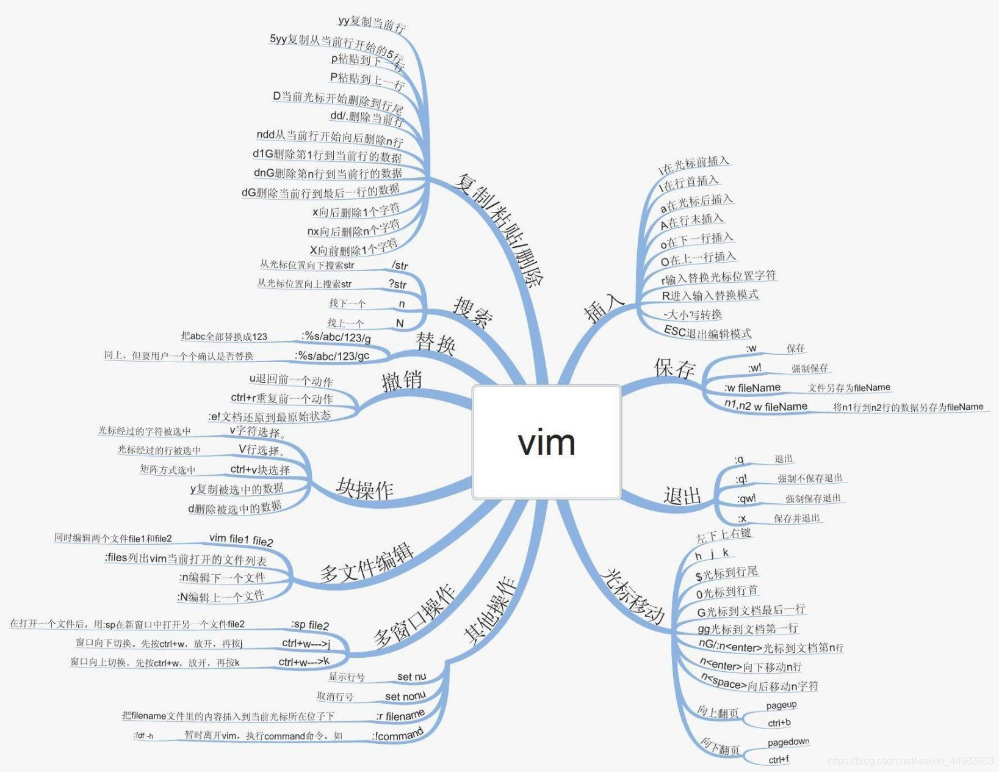
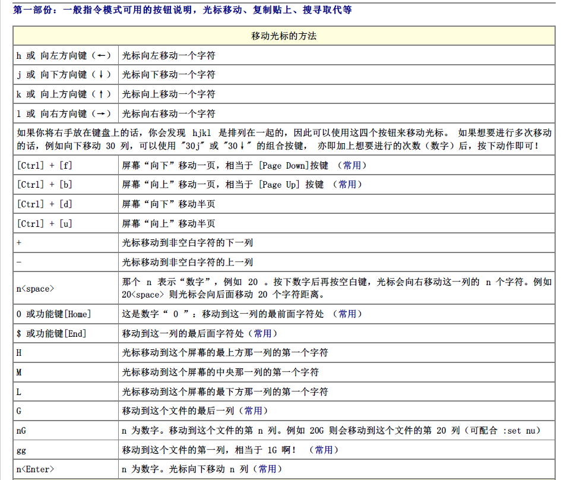
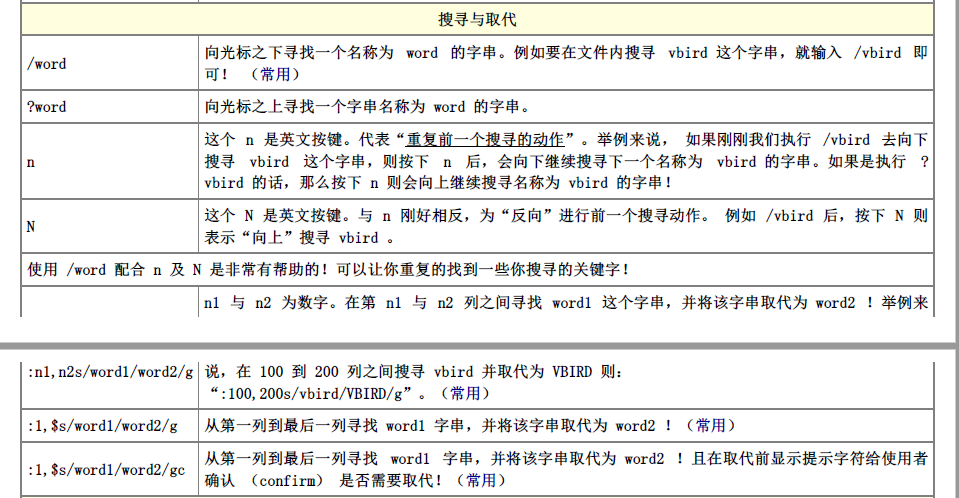
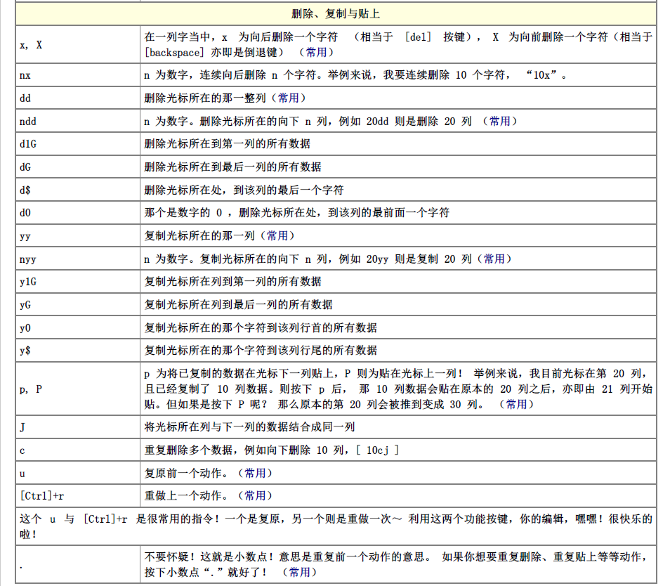
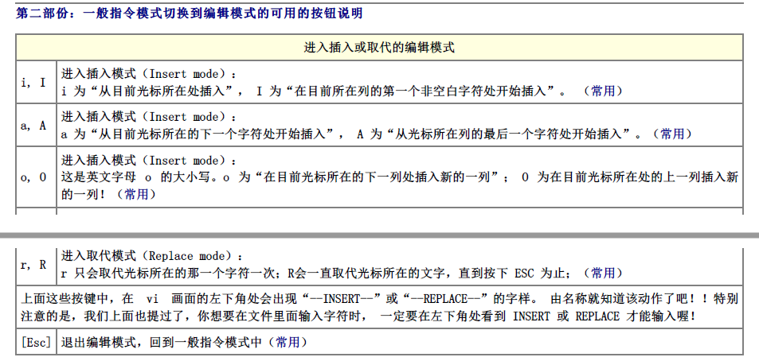
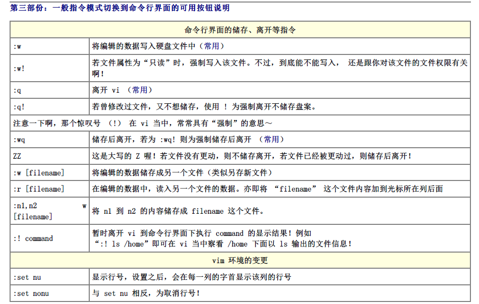

# Linux之vim使用详解

<!--more-->

## vim简介

Vim是从 vi 发展出来的一个文本编辑器。代码补全、编译及错误跳转等方便编程的功能特别丰富，在程序员中被广泛使用，和Emacs并列成为类Unix系统用户最喜欢的文本编辑器。

vim的设计理念是命令的组合。用户学习了各种各样的文本间移动/跳转的命令和其他的普通模式的编辑命令，并且能够灵活组合使用的话，能够比那些没有模式的编辑器更加高效的进行文本编辑。同时VIM与很多快捷键设置和正则表达式类似,可以辅助记忆。并且vim针对程序员做了优化。

### vim模式

打开文件方法：vim filename，默认为编辑模式。

vim是模块化的编辑器，包含三种基本模式：

1、一般指令模式：Normal，默认模式，移动光标，剪切/粘贴文本。

2、编辑模式：Insert，插入模式，用于修改文本。

3、命令行命令模式：内置命令接口（extended command），用于保存、退出等。

### vim模式替换

```shell
一般指令模式 --> 编辑模式：
	i：insert, 在光标所在处输入
	a: append，在光标在处后方输入
	o：在光标所在处的下方打开一个新行
	I：在光标所在行的行首输入
	A：在光标所在行的行尾输入
	O：在光标所在处的上方打开一个新行
					
编辑模式 --> 一般指令模式
	ESC
					
一般指令模式 --> 命令行命令模式
	:
					
命令行命令模式 --> 一般指令模式模式
	ESC，Enter 
```

## 常用vim指令

### 一般指令模式

#### 文件操作

```shell
ZZ                     # 保存并退出
ZQ                     # 不保存退出
```

#### 光标

```shell
# 字符间跳转
h                          # 左
j                          # 下
k                          # 上
l                          # 右			
#COMMAND                   # 跳转由#指定的个数的字符
5k                         # 向上跳转5个字符
3l                         # 向右跳转3个字符

# 单词间跳转
w                          # 下一个单词的词首
e                          # 当前或后一个单词的词尾
b                          # 当前或前一个单词的词首				
#COMMAND                   # 跳转由#指定的个数的单词
3w                         # 跳转到下三个单词的词首

# 行首行尾跳转
^                          # 跳转至行首的第一个非空白字符
0                          # 跳转至行首，数字 0 ，字母 O 和 o 是由编辑模式进入到输入模式
$                          # 跳转至行尾		

# 当前页跳转
H                          # 页首
M                          # 页中间行
L                          # 页底

# 行间跳转
#G                         # 跳转至由#指定的行
1G, gg                     # 第一行
G                          # 最后一行
5G                         # 跳转至第5行

# 句间跳转
)                          # 下一句
(                          # 上一句

# 段间跳转
}                          # 下一段
{                          # 上一段
```

#### 翻屏

```shell
Ctrl+f                     # 向文件尾翻一屏
Ctrl+b                     # 向文件首部翻一屏
Ctrl+d                     # 向文件尾部翻半屏
Ctrl+u                     # 向文件首部翻半屏
Enter                      # 按行向后翻

```

#### 编辑命令

```shell
# 字符编辑
x                          # 删除光标所在处的字符
#x                         # 删除光标所在处起始的#个字符
				
xp                         # 交换光标所在处的字符与其后面的字符的位置
~                          # 转换大小写
J                          # 删除当前行后的换行符

# 替换命令
r                          # 替换光标所在处的字符
R                          # 切换成 REPLACE 模式，可以输入任意字符进行更换

# 删除命令 delete
d                          # 删除命令，可结合光标跳转字符，实现范围删除
	d$                     # 删除到行尾
	d^                     # 删除到非空行首 
	d0                     # 删除到行首				
	dw                     # 删除光标所在处的单词或符号
	d3w                    # 删除光标所在处的三个单词
	de                     # 删除当前或下一个单词
	db                     # 删除当前或前一个单词
	#COMMAND               # 支持使用数字
						
	dd                     # 删除光标所在处的行
	#dd                    # 删除光标所处的行起始的共#行
	3dd                    # 删除光标所处的行起始的3行

# 复制命令
y                          # 复制，工作行为相似于d命令
	y$                     # 复制当前光标处到行尾
	y^                     # 复制当前光标处到非空行首
	y0                     # 复制当前光标处到行首
					
	ye                     # 复制当前或下一个单词
	yw                     # 复制光标所在处的单词
	yb                     # 复制当前或前一个单词
	#COMMAND
							
	yy                     # 复制一整行
	#yy                    # 复制#行


# 粘贴命令
p           # 缓冲区中的内容如果为整行，则粘贴在当前光标所在行的下方
	        # 否则，则粘贴至当前光标所在处的后方

# 改变命令 （相当于移动光标，删除，并进入输入模式）
c$                         # 删除光标所在处至行尾，并切换到输入模式 
c^                         # 非空行首
c0                         # 行首
					
cb                         # 当前或前一个单词
ce                         # 当前或下一个单词
cw                         # 当前单词
#COMMAND
						
cc                         # 删除光标所在的行，并转换为输入模式
#cc                        # 删除光标所在行为起始行3行，并转换为输入模式

# 撤销模式
撤销(undo)操作：
	u                      # 撤销此前的操作；
	#u                     # 撤销此前的#个操作；
						
Ctrl+r        	           # 撤销此前的撤销
					
	.                      # 重复执行前一个编辑操作
```

### 命令行命令模式

#### 文件操作

在编辑模式下，输入“:”进入末行模式，会创建一个命令提示符，处于屏幕底部左侧。

```shell
:q                     # 退出
:q!                    # 强制退出，不保存此前的编辑操作
:wq                    # 保存并退出
:w, :q                 # 保存并退出
:x                     # 保存并退出
:w /PATH/TO/SOMEFILE   # 保存文件至指定的路径
r filename             # 读文件内容到当前文件中
w filename             # 将当前文件内容写入另一个文件
!command               # 执行命令
r!command              # 读入命令的输出
```

#### 地址定界

```shell
命令格式：
:start_pos[,end_pos]
	#                           # 特定的第#行，例如5即第5行
	.                           # 当前行
	$                           # 最后一行
	#,#                         # 指定行范围，左侧为起始行，右侧为结束行
	#,+#                        # 指定行范围，左侧为超始行绝对编号，右侧为相对左侧行号的偏移量；例如：3,+7
		.,$-1
		1,$
	%                           # 全文 
	/pattern/                   # 从光标所在处起始向文件尾部第一次被模式所匹配到的行
		/first/,$
	/pat1/,/pat2/               # 从光标所在处起始，第一次由pat1匹配到的行开始，至第一次由pat2匹配到的行结束之间的所有行
				
可同编辑命令一同使用，实现编辑操作：
	d
	y
	c
				
	w /PATH/TO/SOMEFILE          # 将范围内的文本保存至指定的文件中；
	r  /PATH/FROM/SOMEFILE       # 将指定的文件中的文本读取并插入至指定位置；

```

#### 查找

```shell
/PATTERN：#从当前光标所在处向文件尾部查找能够被当前模式匹配到的所有字符串；
?PATTERN：#从当前光标所在处向文件首部查找能够被当前模式匹配到的所有字符串；
	n：#下一个，与命令方向相同；
	N：#上一个，与命令方向相反；
	
s：末行模式的命令；使用格式：
	s/要查找的内容/替换为的内容/修饰符
		要查找的内容：可使用正则表达式；
		替换为的内容：不能使用下则表达式，但可以引用；
			如果“要查找的内容”部分在模式中使用分组符号：在“替换为的内容”中使用后向引用；
			直接引用查找模式匹配到的全部文本，要使用&符号；
		修饰符：
			i：忽略大小写；
			g：全局替换，意味着一行中如果匹配到多次，则均替换；
						
	可把分隔符替换为其它非常用字符：
		s@@@
		s###

示例：
1、复制/etc/grub2.cfg文件至/tmp目录中，用查找替换命令删除/tmp/grub2.cfg文件中以空白字符开头的行的行首的空白字符；
	%s@^[[:space:]]\+@@
2、复制/etc/rc.d/init.d/functions文件至/tmp目录中，用查找替换命令为/tmp/functions文件的每个以空白字符开头的行的行首加上#；
	%s@^[[:space:]]\+[^[:space:]]@#&@g
3、为/tmp/grub2.cfg文件的前三行的行首加上#号；
	1,3s@^@#@				
4、将/etc/yum.repos.d/CentOS-Base.repo文件中所有的enabled=0替换为enabled=1，所有gpgcheck=0替换为gpgcheck=1；
	%s@\(enabled\|gpgcheck\)=0@\1=1@g
```

## vim其它功能

### 多文件功能

```shell
多文件命令格式：
# vim FILE1 FILE2 ...
在文件间切换：
	:next  下一个
	:prev  上一个
	:first   第一个 
	:last   最后一个

退出所有文件：
	:wqall 保存所有文件并退出；
	:wall
	:qall
```

### 多窗口功能

```shell
-o：水平分割窗口
-O：垂直分割窗口
			
在窗口间切换：Ctrl+w, ARROW
			
注意：单个文件也可以分割为多个窗口进行查看：
	Ctrl+w, s：水平分割窗口
	Ctrl+w, v：垂直分割窗口
```

### 定制vim工作特性

1、临时有效：在末行模式下的设定，仅对当前vim进程有效

2、永久有效：需要修改相应的配置文件，全局配置文件（/etc/vimrc）；用户个人配置文件（～/.vimrc，需要首先创建此文件）

```shell
# 行号
显示：set number, 简写为set nu
取消显示：set nomber, set nonu

#  括号匹配高亮
匹配：set showmatch, set sm
取消：set nosm

# 自动缩进
启用：set ai
禁用：set noai

# 高亮搜索
启用：set  hlsearch
禁用：set nohlsearch

# 语法高亮
启用：syntax on
禁用：syntax off 

#忽略字符大小写
启用：set ic
禁用：set noic	

# 获取帮助
:help
:help subject

# 按TAB产生4个空格
set ts=4        # 注：ts是tabstop的缩写，设TAB宽4个空格
set expandtab

对于已保存的文件，可以使用下面的方法进行空格和TAB的替换：
TAB替换为空格：
:set ts=4
:set expandtab
:%retab!

空格替换为TAB：
:set ts=4
:set noexpandtab
:%retab!

加!是用于处理非空白字符之后的TAB，即所有的TAB，若不加!，则只处理行首的TAB。
```

## 其它

图片引自网络（侵删）




来自鸟哥私房菜基础篇：

**第一部分**：







**第二部分**：



**第三部分**：




