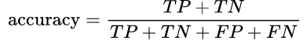
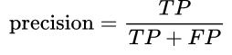
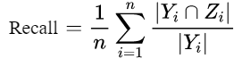

# 机器学习基础概念

<!--more-->

## 评价指标

True Positive(真正，TP)：将正类预测为正类数

True Negative(真负，TN)：将负类预测为负类数

False Positive(假正，FP)：将负类预测为正类数误报 (Type I error)

False Negative(假负，FN)：将正类预测为负类数→漏报 (Type II error)


### Accuracy

准确率计算公式为：




### Precision

精准率表示被分为正例的示例中实际为正例的比例。

在识别出来的图片中，True positives所占的比率。



其中n代表的是（True positives + False positives），也就是系统一共识别出多少张照片。

### Recall

召回率是覆盖面的度量，度量有多少个正例被分为正例。

是被正确识别出来的飞机个数与测试集中所有飞机的个数的比值。



Recall的分母是（true positives + False negatives），即可以理解为一共有多少张目标的总数。

### 其他

鲁棒性：处理缺失值和异常值的能力；


## 向量点积、乘积

### 点积

同线性代数中矩阵乘法的定义： A·B!=B·A。

计算方法：

1、np.dot()

2、A@B （python3）

### 乘积

在Python中，实现对应元素相乘。

计算方法：

1、np.multiply()

2、A * B

## 中心极限定理

中心极限定理是统计学中比较重要的一个定理。 本文将通过实际模拟数据的形式，形象地展示中心极限定理是什么，是如何发挥作用的。

### 什么是中心极限定理（Central Limit Theorem）

**定义**：中心极限定理指的是给定一个任意分布的总体。我每次从这些总体中随机抽取 n 个抽样，一共抽 m 次。 然后把这 m 组抽样分别求出平均值。 这些平均值的分布接近正态分布

举例：*现在我们要统计全国的人的体重，看看我国平均体重是多少。当然，我们把全国所有人的体重都调查一遍是不现实的。所以我们打算一共调查1000组，每组50个人。 然后，我们求出第一组的体重平均值、第二组的体重平均值，一直到最后一组的体重平均值。中心极限定理说：这些平均值是呈现正态分布的。并且，随着组数的增加，效果会越好。 最后，当我们再把1000组算出来的平均值加起来取个平均值，这个平均值会接近全国平均体重。*

其中要注意的几点：

1. **总体本身的分布不要求正态分布**
   上面的例子中，人的体重是正态分布的。但如果我们的例子是掷一个骰子（平均分布），最后每组的平均值也会组成一个正态分布。（神奇！）
2. **样本每组要足够大，但也不需要太大**
   取样本的时候，一般认为，每组大于等于30个，即可让中心极限定理发挥作用。

### 掷骰子Python示例

```python
import numpy as np 
import matplotlib.pyplot as plt
random_data = np.random.randint(1, 7, 10000)
print(random_data.mean()) # 打印平均值
print(random_data.std())  # 打印标准差

samples = []
samples_mean = []
samples_std = []

for i in range(0, 1000):
    sample = []
    for j in range(0, 50):
        sample.append(random_data[int(np.random.random() * len(random_data))])
    sample_np = np.array(sample)
    samples_mean.append(sample_np.mean())
    samples_std.append(sample_np.std())
    samples.append(sample_np)

samples_mean_np = np.array(samples_mean)
samples_std_np = np.array(samples_std)

plt.hist(samples_mean_np, bins=40, normed=0, facecolor="blue", edgecolor="black", alpha=0.7)
# 显示横轴标签
plt.xlabel("X")
# 显示纵轴标签
plt.ylabel("Y")
# 显示图标题
plt.title("X/Y")
plt.show()
```


