# Eclipse环境配置

<!--more-->

## 基本配置

### 1、修改Eclipse默认工作空间编码集，修改成UTF-8

路径： Window → Preferences →  General →  Workspace，修改编码集为 UTF-8。

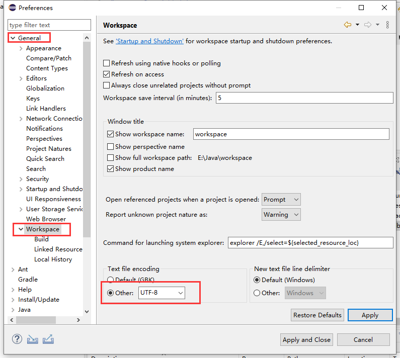


### 2、修改Eclipse的资源文件编码集，修改成UTF-8

路径：Window → Preferences →  General →  Content Types，并点击打开Content Types：中的Text下面的Java Properties File。

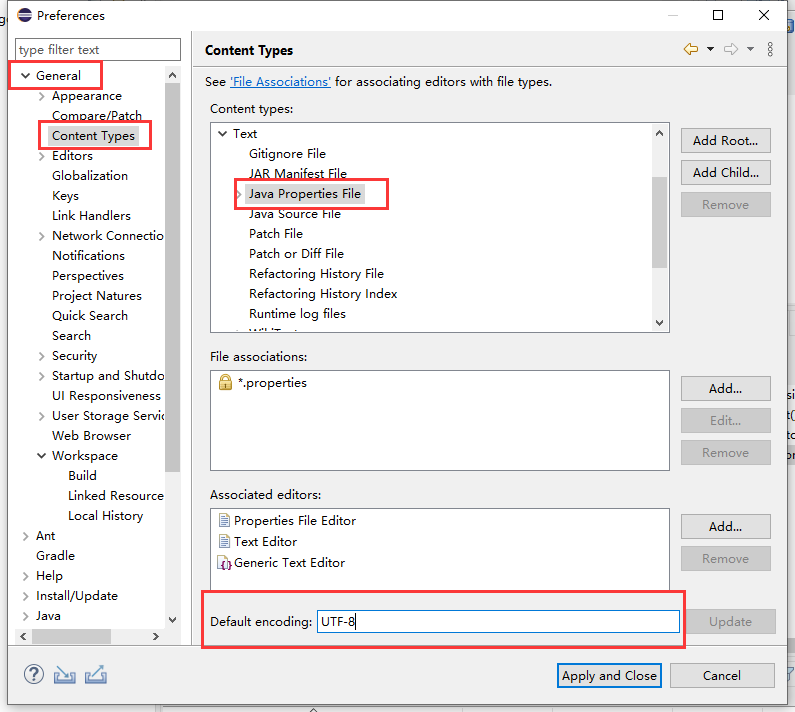

### 3、自动化格式所有行

路径：Window → Preferences →  Java→  Editor  →  Save Actions。

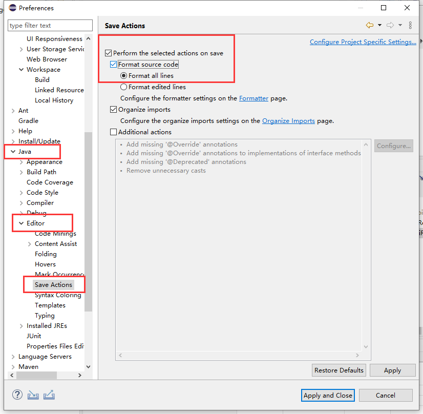


### 4、设置内容自动提示

路径：Window → Preferences →  Java→  Editor  →  Content Assist。

在Auto activation triggers for java对应输入框中输入“.qwertyuiopasdfghjklzxcvbnmQWERTYUIOPASDFGHJKLZXCVBNM”。

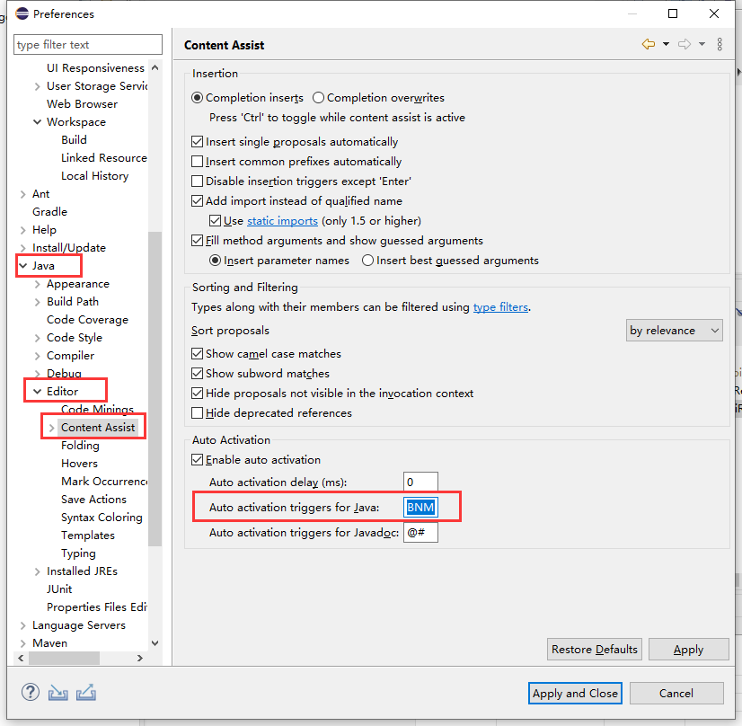


### 5、修改默认浏览器

路径：Window → Preferences →  General →  Web Browser。

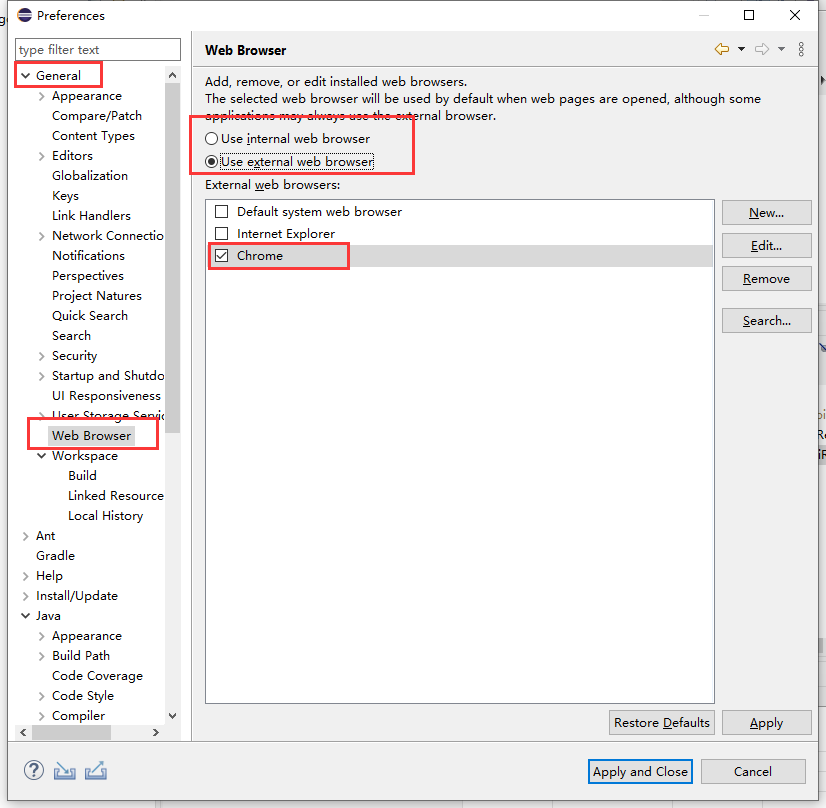


### 6、Eclipse代码模板的构建

eg：

```java
try {
	
} catch (Exception e) {
	throw new RuntimeException(e);
} finally{
 
}
```

路径：Window → Preferences →  Java→  Editor  →  Templates。

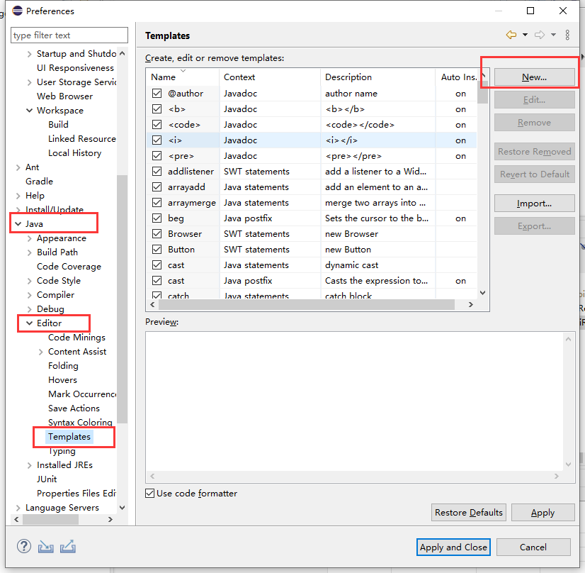

  代码模板构建操作如下图：

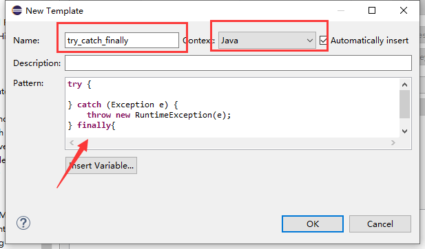


### 7、Eclipse配置类注释模板和方法注释模板

路径：Window → Preferences →  Java→ Code Style → Code Templates。

备注：

1、将光标放到类名上，按下快捷键 alt+shift+j 会添加类的注释。

2、将光标放到方法名上，按下快捷键 alt+shift+j 会添加方法的注释。

配置类的注释模板内容如下：

```java
/**
 * @版权 : Copyright (c) 2020-2021 *********公司技术开发部
 * @author: 作者姓名(一般是写姓名的拼音)
 * @E-mail: 邮箱
 * @版本: 1.0
 * @创建日期: ${date} ${time}
 * @ClassName ${type_name}
 * @类描述-Description:  ${todo}(这里用一句话描述这个方法的作用)
 * @修改记录:
 * @版本: 1.0
 */
```

配置方法的注释模板内容如下

```java
/**
 * @Title: ${enclosing_method}
 * @Description: ${todo}(这里用一句话描述这个方法的作用)
 * ${tags}    參數描述
 * @return ${return_type}  返回类型
 * @throws
 */
```

操作如下图：

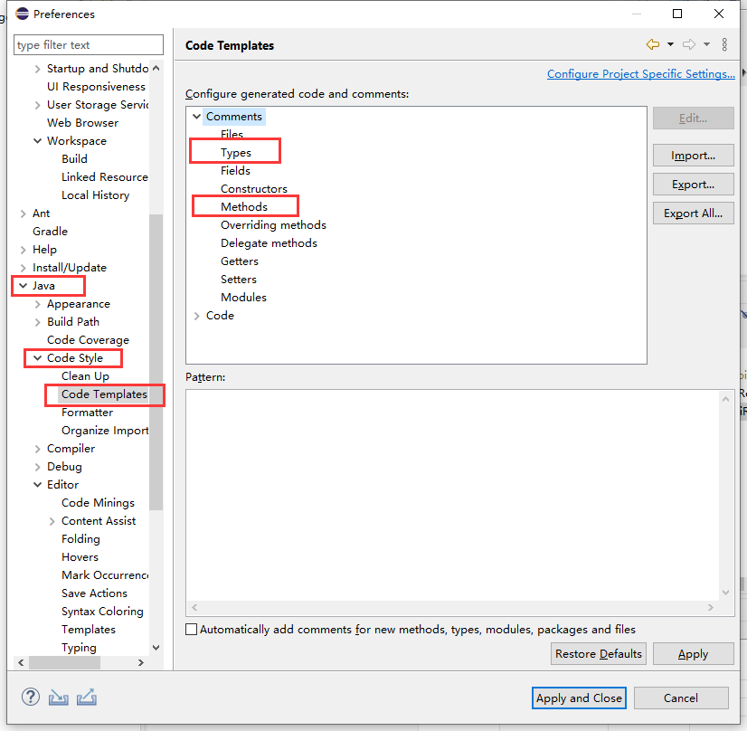


配置创建类时的注释模板：

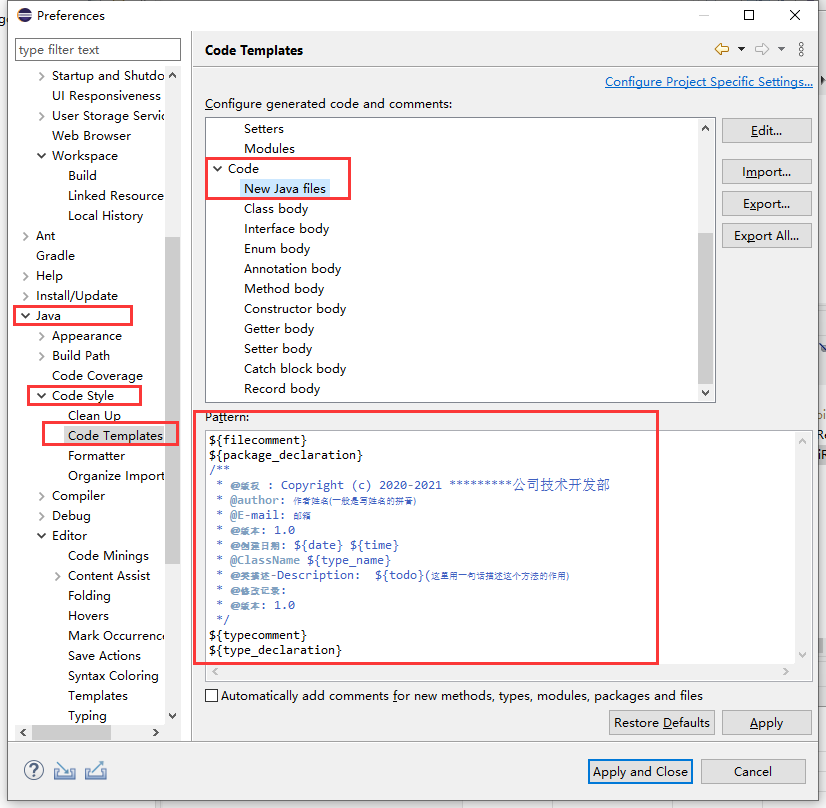


### 8、Eclipse字体大小设置

路径：Window → Preferences →  General → Appearance → Colors and Fonts。

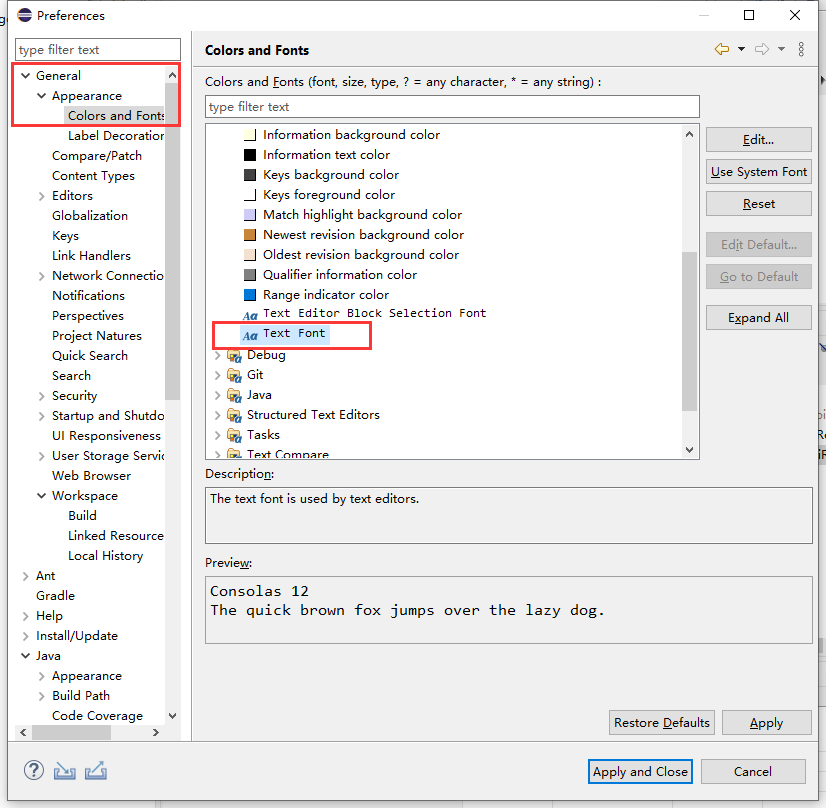


## 环境配置保存

右键点击Package Explorer，点击Export，导出Perferences。

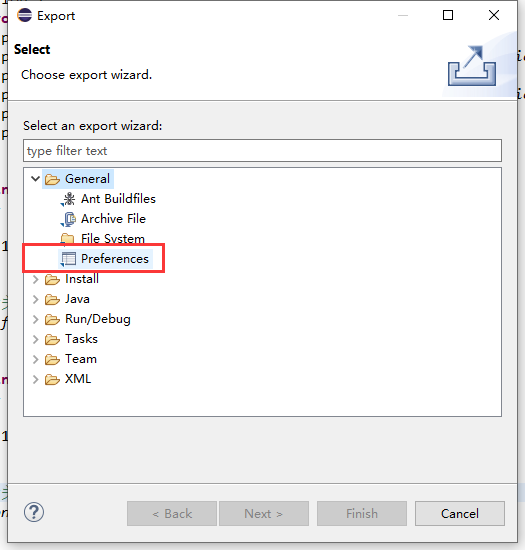


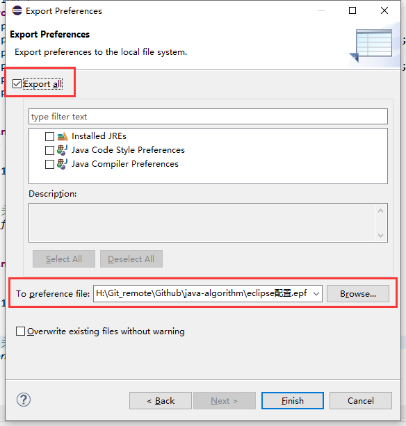


