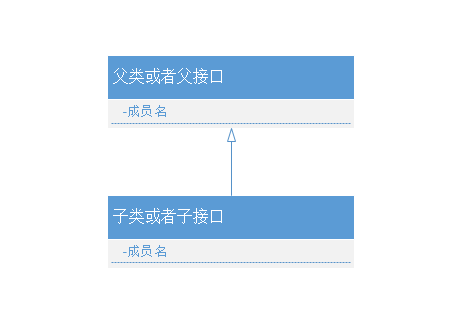
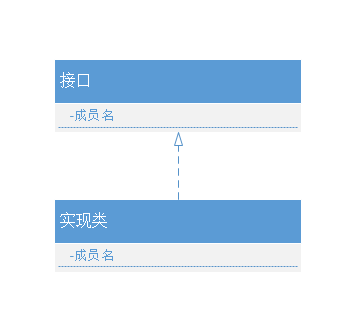

# UML类图的使用

<!--more-->

## 简介

UML类图包含6种关系：继承关系、实现关系、依赖关系、关联关系、聚合关系、组合关系

## 1、继承关系

一个类（子类、子接口）继承另外一个类（称为父类、父接口）的功能，并可以增加自己新功能的能力。在Java继承关系中通过关键字**extends**标识。

图形表示：**空心三角箭头，实线**表示，从子类指向父类，或者子接口指向父接口；

### 2、实现关系

一个Class类实现interface接口（可以多个）的功能，是类与接口之间的关系。在Java中实现关系通过**implements**明确标识。

图形表示：**空心三角箭头，虚线**表示。从类指向接口。

### 3、依赖关系

依赖是一个类A使用到了另一个类B，关系较弱，偶尔调用另一对象或者临时调用，类B的改动会影响到类A。在代码层面为，类B作为参数被类A中的某个method方法中使用。

图形表示：**箭头，虚线**。

### 4、关联关系

关联体现两个类之间有强依赖关系，这种关系比依赖更强，不存在偶然性或者临时性，一般是长期性质的，并且两个类之间的关系是平等的。关联可以是单向、双向的，在代码层面，被关联类B以类的属性存在于关联类A中，也可能是关联类A引用了一个类型为被关联类B的全局变量。

图形表示：**箭头，实线**。

### 5、聚合关系

聚合是关联关系的一种特例，体现整体与部分的关系，即has-a的关系。聚合关系整体与部分可以分离，可以跟组合关系做对比。

例如：家庭和孩子的关系，一个家庭里面可以没有孩子，可以有也可以没有。

图形表示：**空心棱形，实线**。

### 6、组合关系

组合是关联关系的一种特例，体现contains-a的关系，比聚合更强。整体与部分不可分。

例如：人和大脑的关系，人必须有大脑。

图形表示：**实心棱形，实线**。

