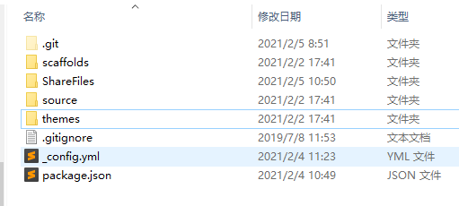

# hexo博客迁移记录

<!--more-->

1、新建hexo分支

git checkout -b hexo

并将推送分支并merge到远程分支

git push origin hexo:hexo

2、删除hexo下面除了.git所有内容


3、将现有hexo目录拷贝到hexo分支下




修改.gitgnore里的内容

```
.DS_Store
Thumbs.db
db.json
*.log
node_modules/
public/
.deploy*/
```


清除npm缓存

删除node_model文件夹，删除package.lock.json文件

npm cache clean --force


使用淘宝npm镜像

npm install cnpm -g --registry=https://registry.npm.taobao.org


然后使用cnpm安装模块

cnpm install hexo

cnpm install

cnpm install hexo-deployer-git

hexo c & hexo g & hexo s