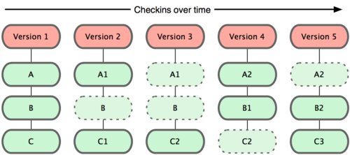

# Git使用基础

<!--more-->

## 概要

### 版本控制

  什么是版本控制？我真的需要吗？版本控制是一种记录若干文件内容变化，以便将来查阅特定版本修订情况的系统。在本书所展示的例子中，我们仅对保存着软件源代码的文本文件作版本控制管理，但实际上，你可以对任何类型的文件进行版本控制。

  如果你是位图形或网页设计师，可能会需要保存某一幅图片或页面布局文件的所有修订版本（这或许是你非常渴望拥有的功能）。采用版本控制系统 （VCS）是个明智的选择。有了它你就可以将某个文件回溯到之前的状态，甚至将整个项目都回退到过去某个时间点的状态。你可以比较文件的变化细节，查出最 后是谁修改了哪个地方，从而导致出现怪异问题，又是谁在何时报告了某个功能缺陷等等。使用版本控制系统通常还意味着，就算你乱来一气把整个项目中的文件改 的改删的删，你也照样可以轻松恢复到原先的样子。但额外增加的工作量却微乎其微。

#### 本地版本控制

  许多人习惯用复制整个项目目录的方式来保存不同的版本，或许还会改名加上备份时间以示区别。这么做唯一的好处就是简单。不过坏处也不少：有时候会混淆所在的工作目录，一旦弄错文件丢了数据就没法撤销恢复。

为了解决这个问题，人们很久以前就开发了许多种本地版本控制系统，大多都是采用某种简单的数据库来记录文件的历次更新差异。

其中最流行的一种叫做 rcs，现今许多计算机系统上都还看得到它的踪影。甚至在流行的 Mac OS X 系统上安装了开发者工具包之后，也可以使用 rcs 命令。它的工作原理基本上就是保存并管理文件补丁（patch）。文件补丁是一种特定格式的文本文件，记录着对应文件修订前后的内容变化。所以，根据每次 修订后的补丁，rcs 可以通过不断打补丁，计算出各个版本的文件内容。


#### 集中化的版本控制系统

  人们又遇到一个问题，如何让在不同系统上的开发者协同工作？于是，集中化的版本控制系统（ Centralized Version Control Systems，简称 CVCS ）应运而生。这类系统，诸如 CVS，Subversion 以及 Perforce 等，都有一个单一的集中管理的服务器，保存所有文件的修订版本，而协同工作的人们都通过客户端连到这台服务器，取出最新的文件或者提交更新。多年以来，这已成为版本控制系统的标准做法（见下图）。

  这种做法带来了许多好处，特别是相较于老式的本地 VCS 来说。现在，每个人都可以在一定程度上看到项目中的其他人正在做些什么。而管理员也可以轻松掌控每个开发者的权限，并且管理一个 CVCS 要远比在各个客户端上维护本地数据库来得轻松容易。

  事分两面，有好有坏。这么做最显而易见的缺点是中央服务器的单点故障。如果宕机一小时，那么在这一小时内，谁都无法提交更新，也就无法协同工作。要 是中央服务器的磁盘发生故障，碰巧没做备份，或者备份不够及时，就还是会有丢失数据的风险。最坏的情况是彻底丢失整个项目的所有历史更改记录，而被客户端 提取出来的某些快照数据除外，但这样的话依然是个问题，你不能保证所有的数据都已经有人事先完整提取出来过。本地版本控制系统也存在类似问题，只要整个项 目的历史记录被保存在单一位置，就有丢失所有历史更新记录的风险。


#### 分布式版本控制系统

  分布式版本控制系统（ Distributed Version Control System，简称 DVCS ）面世了。在这类系统中，像 Git，Mercurial，Bazaar 以及 Darcs 等，客户端并不只提取最新版本的文件快照，而是把原始的代码仓库完整地镜像下来。这么一来，任何一处协同工作用的服务器发生故障，事后都可以用任何一个镜 像出来的本地仓库恢复。因为每一次的提取操作，实际上都是一次对代码仓库的完整备份（见下图）。

  更进一步，许多这类系统都可以指定和若干不同的远端代码仓库进行交互。籍此，你就可以在同一个项目中，分别和不同工作小组的人相互协作。你可以根据需要设定不同的协作流程，比如层次模型式的工作流，而这在以前的集中式系统中是无法实现的。


　　事分两面，有好有坏。这么做最显而易见的缺点是中央服务器的单点故障。如果宕机一小时，那么在这一小时内，谁都无法提交更新，也就无法协同工作。要 是中央服务器的磁盘发生故障，碰巧没做备份，或者备份不够及时，就还是会有丢失数据的风险。最坏的情况是彻底丢失整个项目的所有历史更改记录，而被客户端 提取出来的某些快照数据除外，但这样的话依然是个问题，你不能保证所有的数据都已经有人事先完整提取出来过。本地版本控制系统也存在类似问题，只要整个项 目的历史记录被保存在单一位置，就有丢失所有历史更新记录的风险。

## Git基础

### Git工作方式

  Git 是把变化的文件作快照后，记录在一个微型的文件系统中。每次提交更新时，它会纵览一遍所有文件的指纹信息并对文件作一快照，然后保存一个指向这次快照 的索引。为提高性能，若文件没有变化，Git 不会再次保存，而只对上次保存的快照作一链接。Git 的工作方式如图所示。



### Git工作流程

1、在工作目录中修改某些文件。

2、 对修改后的文件进行快照，然后保存到暂存区域。

3、 提交更新，将保存在暂存区域的文件快照永久转储到 Git 目录中。

  所以，我们可以从文件所处的位置来判断状态：如果是 Git 目录中保存着的特定版本文件，就属于已提交状态；如果作了修改并已放入暂存区域，就属于已暂存状态；如果自上次取出后，作了修改但还没有放到暂存区域，就 是已修改状态。到第二章的时候，我们会进一步了解其中细节，并学会如何根据文件状态实施后续操作，以及怎样跳过暂存直接提交。

在正式使用前，我们还需要弄清楚Git的三种重要模式，分别是**已提交、已修改、已暂存**。


- 已提交(committed):表示数据文件已经顺利提交到Git数据库中。
- 已修改(modified):表示数据文件已经被修改，但未被保存到Git数据库中。
- 已暂存(staged):表示数据文件已经被修改，并会在下次提交时提交到Git数据库中。

## Git使用

### Git初始化

  **git clone**: 这是较为简单的一种初始化方式，当你已经有一个远程的Git版本库，只需要在本地克隆一份，例如'git clone git://github.com/someone/some_project.git some_project'命令就是将'git://github.com/someone/some_project.git'这个URL地址的远程版 本库完全克隆到本地some_project目录下面

   **git init**和**git remote**：这种方式稍微复杂一些，当你本地创建了一个工作目录，你可以进入这个目录，使用 git init 命令进行初始化，Git以后就会对该目录下的文件进行版本控制，这时候如果你需要将它放到远程服务器上，可以在远程服务器上创建一个目录，并把 可访问的URL记录下来，此时你就可以利用 git remote add 命令来增加一个远程服务器端，例如'git remote add origin git://github.com/someone/another_project.git'这条命令就会增加URL地址为'git: //github.com/someone/another_project.git'，名称为origin的远程服务器，以后提交代码的时候只需要使用 origin别名即可。

### Git基本命令

​        **git pull**：从版本库(既可以是远程的也可以是本地的)将**代码更新到本地**，例如：'git pull origin master'就是将origin这个版本库的代码更新到本地的master主枝，该功能类似于SVN的update

​        **git add**：将所有改动的文件（新增和有变动的）**放在暂存区，由git进行管理**。

​        **git rm**：从当前的工作空间中和索引中删除文件，例如'git rm app/model/user.rb'，**移除暂存区**。

​        **git commit**：提交当前工作空间的修改内容，类似于SVN的commit命令，例如'**git commit -m** "story #3, add user model"'，提交的时候必须用-m来输入一条提交信息。

​        **git push**：将本地commit的代码更新到远程版本库中，例如'**git push origin branchname**'就会将本地的代码更新到名为orgin的远程版本库中。

​        **git log**：查看历史日志。

​        **git revert**：**还原一个版本的修改**，必须提供一个具体的Git版本号，例如'git revert bbaf6fb5060b4875b18ff9ff637ce118256d6f20'，Git的版本号都是生成的一个哈希值。

### Git 独有命令

​         **git branch**：对分支的增、删、查等操作，例如 git branch new_branch 会从当前的工作版本创建一个叫做new_branch的新分支，git branch -D new_branch 就会强制删除叫做new_branch的分支，git branch 就会列出本地所有的分支。

​          **git checkout**：Git的checkout有两个作用，其一是在 不同的branch之间进行切换，例如 'git checkout new_branch'就会切换到new_branch的分支上去;另一个功能是 还原代码的作用，例如git checkout app/model/user.rb 就会将user.rb文件从上一个已提交的版本中更新回来，未提交的内容全部会回滚

​          **git rebase**：用下面两幅图解释会比较清楚一些，rebase命令执行后，实际上是将分支点从C移到了G，这样分支也就具有了从C到G的功能 （使历史更加简洁明了）

​                       

​          **git reset**：回滚到指定的版本号，我们有A-G提交的版本，其中C 的版本号是 bbaf6fb，我们执行了'git reset bbaf6fb'那么结果就只剩下了A-C三个提交的版本

​                        

​          **git stash**：将当前未提交的工作存入Git工作栈中，时机成熟的时候再应用回来，这里暂时提一下这个命令的用法，后面在技巧篇会重点讲解

​          **git config**：新增、更改Git的各种设置，例如：git config branch.master.remote origin 就将master的远程版本库设置为别名叫做origin版本库

​          **git tag**：将某个版本打上一个标签，例如：git tag revert_version bbaf6fb50 来标记这个被你还原的版本，那么以后你想查看该版本时，就可以使用 revert_version标签名，而不是哈希值。

### Git其它命令

​        **add**         #添加文件内容至索引

　　**branch**      #列出、创建或删除分支

　　**checkout**     #检出一个分支或路径到工作区

　　**clone**       #克隆一个版本库到一个新目录

　　**commit**  　#最近一次的提交，--amend修改最近一次提交说明

　　**diff**        #显示提交之间、提交和工作区之间等的差异　　

　　**fetch**       #从另外一个版本库下载对象和引用　

　　**init**        #创建一个空的 Git 版本库或重新初始化一个已存在的版本库

　　**log**         #显示提交日志 --stat 具体文件的改动

　　**reflog**　　　　#记录丢失的历史

　　**merge**      #合并两个或更多开发历史，--squash 把分支所有提交合并成一个提交

　　**mv**         #移动或重命名一个文件、目录或符号链接

　　**pull**        #获取并合并另外的版本库或一个本地分支（相当于git fetch和git merge）

　　**push**         #更新远程引用和相关的对象　　

　　**rebase**       #本地提交转移至更新后的上游分支中

　　**reset**         #重置当前HEAD到指定状态

　　**rm**         #从工作区和索引中删除文件

　　**show**        #显示各种类型的对象

　　**status**        #显示工作区状态

　　**tag**         #创建、列出、删除或校验一个GPG签名的 tag 对象 

　　**cherry-pick** #从其他分支复制指定的提交，然后导入到现在的分支

### .git目录结构

```shell
HEAD
branches/
config
description
hooks/
index
info/
objects/
refs/
```

重要的文件和目录需要解释如下：

　　 **HEAD**：文件存放根节点的信息，其实目录结构就表示一个树型结构，Git采用这种树形结构来存储版本信息， 那么HEAD就表示根;

　　 **refs**：目录存储了你在当前版本控制目录下的各种不同引用(引用指的是你本地和远程所用到的各个树分支的信息)，它有heads、 remotes、stash、tags四个子目录，分别存储对不同的根、远程版本库、Git栈和标签的四种引用，你可以通过命令'git show-ref'更清晰地查看引用信息;

　　 **logs**：目录根据不同的引用存储了日志信息。因此，Git只需要代码根目录下的这一个.git目录就可以记录完 整的版本控制信息，而不是像SVN那样根目录和子目录下都有.svn目录。那么下面就来看一下Git与SVN的区别吧

　　 **.gitigmore:** 放一些不需要git管理的文件（例：IDE的工作目录 .idea）

## 实战

### 创建版本库

```bash
mkdir myfile
cd myfile
git init
git add codefile
git commit -m "your description"
```

#### 版本回退

```bash
git log
git log --pretty=oneline
git reset --hard HEAD^
git reset --hard commit_code
git reflog #查看历史操作记录
```

#### 工作区和暂存区

工作区（Working directory）：工作目录文件夹

版本库（Repository）：隐藏目录`.git`是`Git`版本库，其中最重要的就是称为stage（或者叫index）的暂存区，还有Git为我们自动创建的第一个分支`master`，以及指向`master`的一个指针叫`HEAD`。

版本添加，1、先通过`add`将文件添加到暂存区，2、再通过`commit`往当前`master`分区上提交更改


```bash
git status# 查看当前状态
```

#### 管理修改

如果修改文件`add`后，再次修改文件，然后`commit`提交，后面修改的文件未被添加到当前版本库，需要再次添加提交。

```bash
git diff HEAD -- readme.txt #查看工作区和版本库里面最新版本区别
```

#### 撤消修改

让文件回到最近一次`add`或则`commit`的状态

```bash
git check -- filename #使文件复原，撤销修改
git reset HEAD filename #文件add后，重新放回工作区
```

#### 删除文件

命令`git rm`用于删除一个文件。如果一个文件已经被提交到版本库，那么你永远不用担心误删，但是要小心，你只能恢复文件到最新版本，你会丢失**最近一次提交后你修改的内容**。

`git checkout`**其实是用版本库里的版本替换工作区的版本，无论工作区是修改还是删除，都可以“一键还原”。**

```bash
rm filename
git rm filename
git checkout -- filename #撤销删除
```

### 远程仓库

#### 从本地关联远程库

将本地git仓库与远程github仓库同步，关联一个远程库。

把本地库的内容推送到远程，用`git push`命令，实际上是把当前分支`master`推送到远程。只要本地作了提交，都可以通过以下命令将本地仓库推送到远程端。

```bash
git remote add origin git@server-name:path/repo-name.git
git push -u origin master
```

#### 从远程库克隆代码库

```bash
git clone git@github.com:mingrongchen/Algorithm.git
```

### 分支管理

时间线串成一条分支,用`git log --graph`命令可以看到分支合并图，使用`Fast forward`策略，合并分支时，加上`--no-ff`参数就可以用普通模式合并。若分支存在冲突不能快速合并，则解决冲突后再合并。

```bash
git checkout -b newbranch
#-b代表创建并切换到当前分支，相当于
#git branch newbranch ，创建分支
#git checkout newbranch， 切换分支
git branch #查看分支
# 切换到主分支
git merge newbranch#在主分支合并新的分支
git branch -d newbranch#合并后删除分支
```

#### bug分支

若当前工作未完成，需要解决一个bug分支，可以使用`stash`功能，将当前工作区隐藏，解决完bug分支后，再恢复现场继续工作。如果要丢弃一个没有被合并过的分支，可以通过`git branch -D <name>`强行删除。

```bash
git stash  #隐藏当前分支
#解决bug
git checkout master #在主分支上创建bug分支
git checkout -b issue-101#创建bug分支，一系列代码提交
git checkout master #切换回主分支，合并bug分支
git merge --no-ff -m "merge bug fix 101" issue-101

git checkout myworkstation#切换回自己当前分支
git stash apply #恢复当前内容or git stash pop 恢复后删除stash内容
git stash list # 查看stash内容
git stash apply stash@{0} #恢复指定stash，工作区
```
